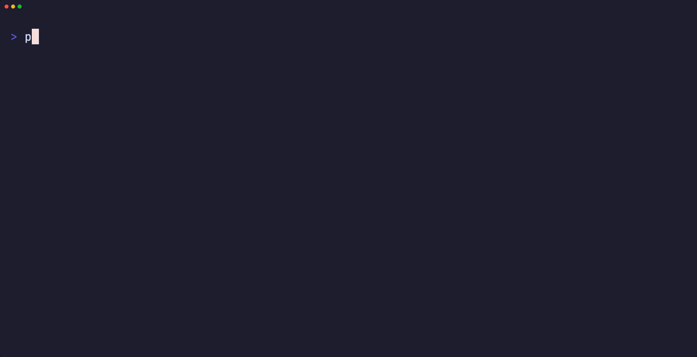

# pgoverlay

[](https://github.com/abd-ulbasit/pgoverlay/actions/workflows/ci.yml)

`git branch` for Postgres: seed once from any running database, then spin up isolated, writable copies that never write back to it.

Branches are **OverlayFS copy-on-write** mounts over `PGDATA`. Every branch shares one read-only copy of the seeded source and stores only the blocks it actually changes, so creating one is a mount rather than a copy — 5 GiB branched in **1.89 s** behind a **33.1 MiB** writable layer, and the same 1.89 s at 1 GiB. Each branch is its own live Postgres container, so branches run concurrently, and a branch can itself be branched.



*branching a 1 GiB database, recorded for real — see [docs/benchmarks.md](docs/benchmarks.md)*

## The copy-on-write system that copied the whole database

The first real benchmark said branching a 5 GiB database took **61.9 s** and left a **5.05 GiB** writable layer behind. For a design whose entire premise is that branches share one base and store only what they change, that is not a slow path — it is the feature not working. Create time tracked the VM's effective disk throughput (~87 MB/s), which is what copying 5 GiB looks like.

**The diagnosis.** A branch is a stock `postgres` container whose `PGDATA` is an OverlayFS mount: the seeded source volume read-only below, an empty writable volume on top. The seed comes from `pg_basebackup`, so a branch's first boot is crash recovery — and *before* replaying any WAL, Postgres runs `SyncDataDirectory`. Under the default `recovery_init_sync_method=fsync`, that pass opens **every** file in the data directory read-write in order to fsync it. On OverlayFS, a read-write open of a lower-layer file forces a full copy-up of that file. So the sync pass that runs before recovery copied the entire dataset into a supposedly empty writable layer, before the branch could serve a single query. The WAL replay it was preparing for was trivial: `redo done ... elapsed: 0.00 s` in the branch logs.

Two measurements turned that from a theory into the cause. The writable layer immediately after create was ≈ the full database size (5.05 GiB for a 5.00 GiB database; 1.05 GiB for a 1.00 GiB one). And a control run identical except for `-c recovery_init_sync_method=syncfs` finished recovery with the writable layer at **16 KiB** — no copy-up at all.

**The fix is that flag**, now in the branch entrypoint ([`internal/cow/entrypoint.sh`](internal/cow/entrypoint.sh)): one `syncfs()` call per filesystem instead of a per-file fsync pass. It opens nothing read-write, so it copies nothing up, and it syncs a *superset* of what the per-file pass covered — the durability guarantee that pass exists for is preserved, and crash-recovery semantics are unchanged. `syncfs` is Linux-only and Postgres 14+, which is why PG 13 and older are unsupported here.

| 5.00 GiB database | branch create (p50 of 5) | writable layer after create |
|---|---|---|
| before | 61.9 s | 5.05 GiB |
| after | **1.89 s** | **33.1 MiB** |

Creation is now independent of database size — 1.90 s at 1 GiB, 1.89 s at 5 GiB, on a Colima VM on an M1 Pro. The cost did not disappear, it moved: OverlayFS copies up whole files and Postgres heap/index segments run to 1 GiB each, so a branch that rewrites everything still converges on ~1× the database — paid per file at first write instead of all at once at create. [docs/benchmarks.md](docs/benchmarks.md) has both tables in full, the methodology, the hardware, and the pre-fix numbers kept intact, including the write-amplification column that looked better before the fix than after it.

The long-form write-up of the diagnosis — what `SyncDataDirectory` does, why OverlayFS turns it into a full copy, and how the control run pinned it down — is [**Postgres copied 5 GiB before recovery started**](https://basit.engineer/posts/postgres-copied-5gb-before-recovery-started.html).

## The alternatives, and where pgoverlay sits

Every team wants production-like databases for development, CI, and PR review apps. The options today:

- **`pg_dump`/`pg_restore` or `createdb -T`** — a full physical copy every time. Minutes to hours for real datasets, and N copies cost N times the disk.
- **Neon / Supabase branching** — genuinely instant, but cloud-only. Your data lives on their storage layer; you can't point them at the Postgres you already run.
- **DBLab (Database Lab Engine)** — self-hosted thin clones, but built around ZFS (or LVM) pools you must provision and operate.

pgoverlay takes the middle path: plain Docker, plain Postgres images, and OverlayFS copy-on-write — the same mechanism container images use — applied to `PGDATA`. No special filesystem, no cloud, no fork of Postgres.

## Quickstart

**New here?** [**Ways to use pgoverlay**](docs/usage.md) walks through the common workflows — local dev, a database per test, branch-per-PR, preview environments, and reviewing migrations with `pgb diff` — each with a worked example.

Requirements: Docker (Colima works on macOS), Go 1.26.5+ to build. The source database needs `wal_level=replica` and a user with `REPLICATION` privilege (pg_basebackup does the seeding) — or use `--via dump` for managed Postgres, see below.

```bash
make build   # produces ./bin/pgb (CLI) and ./bin/branchd (daemon)
```

Demo source (skip if you already have a Postgres reachable from containers):

```bash
docker run -d --name demo-src -e POSTGRES_PASSWORD=secret postgres:17 \
  -c wal_level=replica -c max_wal_senders=4
docker exec demo-src sh -c 'until pg_isready -U postgres; do sleep 1; done'
docker exec demo-src psql -U postgres \
  -c "CREATE TABLE t(i int); INSERT INTO t SELECT generate_series(1,100000);"

# The stock postgres image's pg_hba.conf has no remote *replication* entry
# (the catch-all "host all all all" doesn't match replication connections):
docker exec demo-src sh -c \
  'echo "host replication all all scram-sha-256" >> "$PGDATA/pg_hba.conf"'
docker exec demo-src psql -U postgres -c "SELECT pg_reload_conf();"

SRC_IP=$(docker inspect -f '{{.NetworkSettings.IPAddress}}' demo-src)
```

Seed once, branch many:

```bash
PGPASSWORD=secret ./bin/pgb source add main --host "$SRC_IP" --user postgres

./bin/pgb branch create pr-1 --from main
# branch "pr-1" ready in 2.533s (port 32774)

./bin/pgb branch ls
psql "$(./bin/pgb connect pr-1)" -c "SELECT count(*) FROM t"   # 100000

# Writes stay in the branch — the source is mounted read-only underneath:
psql "$(./bin/pgb connect pr-1)" -c "DELETE FROM t WHERE i > 50000"
docker exec demo-src psql -U postgres -c "SELECT count(*) FROM t"  # still 100000

./bin/pgb branch destroy pr-1
docker rm -f demo-src
```

`--host` must be reachable *from containers* (use `host.docker.internal` for a host-local DB, or `--network <net>` for a DB on a Docker network). The password is read from the env var named by `--password-env` (default `PGPASSWORD`). State lives in `~/.pgoverlay` (override with `PGOVERLAY_HOME`).

### Seeding from managed Postgres (Supabase, Neon, RDS)

Managed providers don't allow physical replication connections, so `pg_basebackup` can't seed from them. `--via dump` seeds with `pg_dump` piped into a fresh cluster instead — it needs only a normal user (no `REPLICATION` privilege), and can be scoped to schemas:

```bash
PGPASSWORD=... ./bin/pgb source add prod --via dump --dump-schema public \
  --host db.<ref>.supabase.co --port 5432 --user postgres --pg-version 17
```

`--pg-version` must be **>=** the remote server's major version (`pg_dump` cannot dump newer servers); branches run on `--pg-version`. A logical dump is slower than `pg_basebackup` at size, but branching afterwards is the same instant CoW either way.

Branches can self-destruct (`--ttl 24h`, reaped by `branchd`), be reset to their source snapshot (`pgb branch reset pr-1` — discards all writes, new container/port), and sources can be re-seeded (`pgb source refresh main` — existing branches keep their old snapshot; new branches see the fresh one) or removed (`pgb source rm main`).

## Run the server (`branchd`)

`branchd` is the daemon form: a REST API and a Postgres wire-protocol router in one process, sharing the engine the CLI embeds, plus a TTL reaper for abandoned branches.

```bash
make build                       # produces ./bin/pgb and ./bin/branchd
PGOVERLAY_TOKEN=$(openssl rand -hex 16) ./bin/branchd
# 2026/06/10 12:00:00 REST API listening on :7070
# 2026/06/10 12:00:00 pg router listening on :6432 (connect with dbname@branch)
```

Flags: `--api-addr :7070` (REST), `--pg-addr :6432` (router), `--reap-interval 30s` (TTL reaper tick), `--rotate-branch-credentials` (give every branch its own generated password instead of inheriting the source's — returned as `password` in branch responses; see [docs/architecture.md](docs/architecture.md)). `PGOVERLAY_TOKEN` is required — branchd refuses to start without it; every `/v1` request needs `Authorization: Bearer <token>` (`GET /healthz` is open). `SIGINT`/`SIGTERM` shut down gracefully and leave branch containers running.

REST API:

```bash
AUTH="Authorization: Bearer $PGOVERLAY_TOKEN"

# sources (the password is used for pg_basebackup only — never stored)
curl -H "$AUTH" -d '{"name":"main","host":"host.docker.internal","port":5432,
  "user":"postgres","pg_version":"17","password":"secret"}' localhost:7070/v1/sources
curl -H "$AUTH" localhost:7070/v1/sources
curl -H "$AUTH" -d '{"password":"secret"}' localhost:7070/v1/sources/main/refresh
curl -H "$AUTH" -X DELETE localhost:7070/v1/sources/main

# branches (ttl_seconds=0 or omitted = never reaped)
curl -H "$AUTH" -d '{"name":"pr-42","source":"main","ttl_seconds":86400}' localhost:7070/v1/branches
curl -H "$AUTH" localhost:7070/v1/branches
curl -H "$AUTH" localhost:7070/v1/branches/pr-42
curl -H "$AUTH" localhost:7070/v1/branches/pr-42/usage   # {"bytes":N} — rw-layer size (runs a helper container)
curl -H "$AUTH" -X POST localhost:7070/v1/branches/pr-42/reset
curl -H "$AUTH" -X DELETE localhost:7070/v1/branches/pr-42
```

**One stable endpoint for every branch.** Instead of chasing per-branch host ports, connect to the router on `:6432` with the branch name suffixed to the database:

```bash
psql "host=localhost port=6432 dbname=postgres@pr-42 user=postgres"
```

The router reads the startup message, resolves `pr-42` to its container, rewrites the database back to `postgres`, and relays bytes transparently from then on — authentication (including SCRAM) happens between your client and the branch's Postgres, untouched.

The CLI drives a running branchd in server mode:

```bash
export PGOVERLAY_SERVER=http://localhost:7070   # or --server per command
export PGOVERLAY_TOKEN=<same token as branchd>
pgb branch create pr-42 --from main --ttl 24h
pgb connect pr-42    # prints the direct-port URL and the :6432 proxy URL
```

`pgb branch ls --usage` adds a SIZE column showing each branch's copy-on-write rw layer (its own writes, not the shared source data). It runs one helper container per branch, so it's opt-in.

Honest caveat: the registry is SQLite, which is single-writer. Don't run local-mode CLI commands (no `--server`) against the same `PGOVERLAY_HOME` while branchd is running — use server mode; that's the supported combination.

## Web UI

branchd serves a small embedded web UI at `http://localhost:7070/ui/` (the exact URL is logged at startup) — a single static page baked into the binary, no build toolchain, no CDN, works air-gapped. Paste your `PGOVERLAY_TOKEN` once (kept in the browser's localStorage); the page lists sources and branches with state, endpoint, expiry countdown and rw-layer disk usage, and has create/reset/destroy controls. Auto-refreshes every 5 seconds.

*(screenshot placeholder: dark monospace dashboard with sources and branches tables)*

## Run on Kubernetes

branchd can run in-cluster with branches as pods (`--runtime kube`). A Helm chart deploys the whole thing — for a soup-to-nuts AWS walkthrough (Terraform, images, LoadBalancers, version upgrades, and the production bugs found doing it) see [docs/eks.md](docs/eks.md):

```bash
make docker-build                          # builds ghcr.io/abd-ulbasit/pgoverlay-branchd:dev (push it, or `kind load` for local clusters)
helm install pgoverlay deploy/helm/pgoverlay \
  --namespace pgoverlay-system --create-namespace \
  --set node=<storage-node-name> \
  --set token=$(openssl rand -hex 16)
```

Values that matter:

- **`node` (required)** — the name of the **storage node** (`kubectl get nodes`). All CoW data lives under `dataRoot` (default `/var/lib/pgoverlay`) on this one node as plain directories; branchd, every branch pod, and every helper pod are pinned there with `nodeName` + `hostPath`. This is the default `hostpath` storage mode; set `storage.mode=csi` with `storage.storageClass=<class supporting PVC cloning>` for multi-node storage — branches become PVC clones, pods schedule on any node, and no `SYS_ADMIN` is needed (see [docs/kubernetes.md](docs/kubernetes.md)).
- **`token` / `existingSecret`** — the REST API bearer token. Either let the chart render a Secret from `token`, or point `existingSecret` at a pre-created Secret with key `token`.
- **`proxy.service.type`** — set to `NodePort` (with `proxy.service.nodePort`) to reach branches from outside the cluster without a port-forward.

The chart creates a single-replica Deployment (branchd's registry is SQLite — single writer, so one replica, `Recreate` strategy, state in `hostPath <dataRoot>/state` on the storage node), a namespace-scoped Role (pods create/delete/get/list/watch, pods/exec, pods/log — branchd manages pods only in its own namespace), and two Services: `pgoverlay-api` (REST, :7070) and `pgoverlay-proxy` (Postgres router, :6432). The branchd container runs as root for write access to its hostPath state dir; branch pods get `CAP_SYS_ADMIN` for their in-container overlay mount, same as on Docker.

Using it is the same REST API as above; branch hosts are pod IPs, so connect via the proxy Service:

```bash
kubectl -n pgoverlay-system port-forward svc/pgoverlay-api 7070 &
curl -H "$AUTH" -d '{"name":"main","host":"db.prod.internal","port":5432,
  "user":"postgres","password":"secret"}' localhost:7070/v1/sources
curl -H "$AUTH" -d '{"name":"pr-42","source":"main"}' localhost:7070/v1/branches

# in-cluster: psql "host=pgoverlay-proxy.pgoverlay-system port=6432 dbname=postgres@pr-42 user=postgres"
kubectl -n pgoverlay-system port-forward svc/pgoverlay-proxy 6432 &
psql "host=localhost port=6432 dbname=postgres@pr-42 user=postgres"
```

`make helm-test` lints and grep-asserts the rendered chart; `make k8s-it` runs the full integration suite against a local [kind](https://kind.sigs.k8s.io) cluster (`hack/kind-up.sh` creates `pgoverlay-test` and preloads images).

## Branch per pull request

`pgoverlay-github` (`cmd/pgoverlay-github`, image `ghcr.io/abd-ulbasit/pgoverlay-ghook` via `make docker-build-ghook`) turns pull requests into branches: a signed GitHub webhook creates `pr-<number>` when a PR opens, optionally resets it on every push, and destroys it on close. It reports back as a `pgoverlay/branch` commit status (pending → success/failure, so CI can gate on branch readiness) plus a live connect-info comment kept current on the PR, authenticating either as a GitHub App (installation tokens minted from the App key) or with a plain PAT. The Helm chart ships it as an optional sub-deployment (`--set ghook.enabled=true ...`). Setup, permissions, and the full `GHOOK_*` environment reference live in [docs/github-app.md](docs/github-app.md).

See it end-to-end on a real pull request — a migration that passes on an empty dev database, fails against the PR's masked clone of production (37 legacy duplicate emails), gets fixed, and the branch is destroyed on merge: [pgbranch-demo PR #1](https://github.com/abd-ulbasit/pgbranch-demo/pull/1).

## Branches in your test suite

Every test gets its own copy-on-write branch — full production-shaped data, isolated writes, destroyed when the test ends. In Go (`pgoverlaytest` is self-contained: no pgoverlay internals, no extra dependencies; the test is skipped when `PGOVERLAY_SERVER` is unset):

```go
func TestOrderTotals(t *testing.T) {
    t.Parallel()
    b := pgoverlaytest.Acquire(t)        // branch created, ready, destroyed via t.Cleanup
    db, _ := sql.Open("pgx", b.DSN)
    // ...
}
```

In CI, the composite action provisions the branch and waits for readiness:

```yaml
- uses: abd-ulbasit/pgoverlay/action@v1.0.0-rc.3
  id: branch
  with:
    server: ${{ vars.PGOVERLAY_SERVER }}
    token: ${{ secrets.PGOVERLAY_TOKEN }}
- run: go test ./...   # steps.branch.outputs.{host,port,database}
- uses: abd-ulbasit/pgoverlay/action/destroy@v1.0.0-rc.3
  if: always()
  with: { server: "${{ vars.PGOVERLAY_SERVER }}", token: "${{ secrets.PGOVERLAY_TOKEN }}", branch: "${{ steps.branch.outputs.branch }}" }
```

A zero-dependency JS package (`sdk/js`, `pgoverlay-test`) covers Node test suites. Naming, TTL safety nets, and parallelism semantics: [docs/testing.md](docs/testing.md).

## What changed in a branch?

`pgb diff NAME` (API: `GET /v1/branches/{name}/diff`) compares a branch against the exact base it was cloned from — schema first (a unified diff of `pg_dump --schema-only` output), then per-table row-count deltas:

```console
$ pgb diff pr-42
@@ -312,6 +312,14 @@
 CREATE TABLE public.users (
     id integer NOT NULL,
+    deleted_at timestamp with time zone,
     email text
 );
+CREATE TABLE public.audit_log (
+    id bigint NOT NULL,
+    entry jsonb
+);

TABLE      BASE   BRANCH  DELTA
audit_log  0      1204    +1204
users      51230  51198   -32
(row counts are planner estimates)
```

Under the hood the engine provisions a temporary branch from the target's recorded base (same source generation and frozen-layer chain — not the source's current state) and dumps both instances, so a diff takes a few seconds and never touches the source. Row counts come from `pg_class.reltuples`: planner estimates, exact enough to see what a migration did, not an audit. `--all` lists unchanged tables too.

## How it works

`pgb source add` runs `pg_basebackup` in a one-shot helper container, streaming the source cluster into a named Docker volume. That volume becomes the read-only **lower layer** for every branch.

`pgb branch create` creates one empty volume for the branch's writes, then starts a stock `postgres:17` container with a tiny entrypoint that assembles an OverlayFS mount *inside the container* (so the same code works on Colima/macOS and bare Linux — volumes sit on ext4 inside the VM):

```
            host (pgb CLI)
            │  SQLite registry · saga orchestration · Docker API
            ▼
 ┌─ branch container (CAP_SYS_ADMIN) ──────────────────────────┐
 │                                                             │
 │   PGDATA = /pgoverlay/merged   ← overlayfs mount             │
 │                ▲                                            │
 │     ┌──────────┴───────────┐                                │
 │     │ upper+work (writes)  │  volume: pgoverlay-br-pr-1-rw   │
 │     ├──────────────────────┤                                │
 │     │ lower (read-only)    │  volume: pgoverlay-src-main ────┼─▶ shared by
 │     └──────────────────────┘  (pg_basebackup snapshot)      │   all branches
 │                                                             │
 │   entrypoint.sh: mount overlay → exec docker-entrypoint.sh  │
 └─────────────────────────────────────────────────────────────┘
```

Postgres starts on the merged view and performs ordinary WAL crash recovery — exactly as if the machine had power-cycled at backup time. Pages a branch modifies are copied up into its own volume on first write; everything else is read through the shared lower layer. Branches are fully isolated from the source and from each other.

Host-side Go code is pure control plane: a SQLite registry with a journaled state machine, and create/destroy implemented as sagas (every step registers a compensation, so a failure mid-create leaves no orphan containers or volumes).

For hosts that already run ZFS there is an **experimental zfs backend** (`branchd --cow zfs --zfs-dataset tank/pgoverlay`): branches become `zfs snapshot` + `zfs clone` instead of overlay layers — block-level CoW, no whole-file copy-up. It is unit-tested with manual-verification instructions (no ZFS in this project's CI); see [docs/zfs.md](docs/zfs.md) before relying on it.

## Scope: what this is and isn't

pgoverlay is a **dev/test tool**. Branches are disposable Postgres instances for development, CI, PR review apps, and migration rehearsal.

It is **not** a production database platform: no HA, no replication of branches, no backups, no connection pooling, and the branch container needs `CAP_SYS_ADMIN` (for the overlay mount) — fine for a dev box or CI runner, not something to expose to untrusted workloads. A branch is a point-in-time snapshot; it does not follow the source after seeding.

Branching from another branch works (`pgb branch create child --from-branch parent`), with one caveat worth knowing on the default overlay backend: it is a **freeze**, so the parent is checkpointed, stopped and restarted over its now-immutable layer — a brief parent interruption, and roughly 2× the create time of branching from a source ([benchmarks](docs/benchmarks.md#branch-from-branch)). The ZFS and CSI backends snapshot/clone the parent instead, with no freeze and no parent restart.

## Supported Postgres versions

| Postgres major | 13 and older | 14 | 15 | 16 | 17 (default) | 18 |
|---|---|---|---|---|---|---|
| Supported | ❌ | ✅ | ✅ | ✅ | ✅ | ✅ |

Declare the major when registering a source (`pgb source add main --pg-version 16 …`, or `"pg_version":"16"` over the API); branches then run `postgres:<major>` so the binary matches the seeded data directory. Versions outside 14–18 are rejected at registration time.

PG 13 and older are unsupported because branch startup passes `-c recovery_init_sync_method=syncfs`, a GUC added in **PG 14** — it is what makes WAL crash recovery on a fresh overlay fast (one `syncfs()` instead of fsyncing every data file; see [benchmarks](docs/benchmarks.md)). The matrix is exercised end-to-end by `make matrix` (seed → branch → verify → destroy per major; defaults to 14 and 18, the range edges).

## Comparison

|  | pgoverlay | Neon | DBLab (DLE) | pg_dump/restore |
|---|---|---|---|---|
| Branch creation | seconds, CoW | seconds, CoW | seconds, CoW | minutes–hours, full copy |
| Disk per branch | rw overlay, ~33 MiB + files written ([benchmarks](docs/benchmarks.md)) | only changed pages | only changed pages | full copy |
| Works with your existing Postgres | yes (pg_basebackup from any PG) | no — data must live in Neon | yes | yes |
| Self-hosted | yes | cloud service | yes | yes |
| Infra requirements | Docker only | — | ZFS/LVM pool to provision | none |
| Postgres | stock images | forked storage engine | stock | stock |
| Production-grade HA | no (dev/test tool) | yes | no (dev/test tool) | n/a |

## Roadmap

- **Phase 2** ✅ — `pgproxy` wire-protocol router (one stable endpoint, route by branch name), REST API + auth (`branchd` daemon reusing the same engine), TTL reaper for abandoned branches, branch reset, source refresh with generations. Branch-from-branch moved to a later phase.
- **Phase 3** ✅ — Kubernetes runtime driver (branch pods on a storage node), Helm chart, GitHub webhook service (a branch per PR, automatically).
- **Phase 4** ✅ — data masking hooks, embedded web UI with per-branch disk usage, published benchmarks (with the copy-up fix they motivated), experimental ZFS backend, docs site.
- **Phase 5** ✅ — TLS (router + REST API), Postgres 14–18 support matrix, branch-from-branch (frozen-layer DAG), multi-node CSI storage for Kubernetes (PVC-clone branches, no `SYS_ADMIN`, any node).
- **Phase 6** ✅ — GitHub story (commit statuses, App auth, live PR comment, git-ref branch naming), test-suite SDKs (Go + JS) and a reusable Action, dump-based seeding for managed Postgres (Supabase/Neon/RDS), per-branch credential rotation, registry on a PVC, and `pgb diff`.
- **Phase 7 — road to v1** ✅ — operational trust: Prometheus `/metrics` + real `/readyz`; a periodic reconcile loop with leak-proof, instance-scoped GC (`pgb doctor`/`pgb gc`); a role-based authz model (scoped API tokens, proxy TLS, namespaced deployer RBAC); and HA via leader election.
- **Future** — merge-back of branch data and multi-writer branches remain non-goals; ideas welcome in issues.

## How this was built

Most of the commits here carry a `Co-authored-by: Claude` trailer — run `git log --grep='^Co-authored-by: Claude' -i --oneline | wc -l` against `git log --oneline | wc -l` for the current ratio. I build with coding agents running in parallel git worktrees — one per phase of the roadmap above — and I review, benchmark, and integrate what comes back; the phase structure in the roadmap is what that parallelism is organised around. The parts that decided the shape of this project were not generated: the OverlayFS copy-up diagnosis at the top of this README came from reading `SyncDataDirectory`, instrumenting the writable layer, and running a single-variable control to prove the mechanism, and [docs/benchmarks.md](docs/benchmarks.md) still carries the pre-fix numbers that contradicted the project's own thesis rather than quietly replacing them. If you want to judge the engineering rather than the tooling, read that file and [docs/deep-dives.md](docs/deep-dives.md).

## Documentation

`docs/` is a small MkDocs site — no hosting or CI, build it locally with `pip install mkdocs-material && mkdocs serve`:

- [Quickstart](docs/quickstart.md) — Docker on a laptop: CLI, `branchd`, REST API, router, web UI.
- [Ways to use it](docs/usage.md) — local dev, a DB per test, branch-per-PR, preview environments, reviewing migrations.
- [Benchmarks](docs/benchmarks.md) — measured numbers, methodology, and the copy-up diagnosis.
- [Core concepts](docs/concepts.md) — copy-on-write, OverlayFS layers, seeding, the frozen-layer DAG, from first principles.
- [Architecture](docs/architecture.md) — components, CoW mechanics, sagas, generations, routing — as built.
- [Code tour](docs/code-tour.md) — the codebase package by package, plus the branch-create and proxy request paths.
- [Design decisions](docs/DESIGN-DECISIONS.md) — ten ADRs: no operator, SQLite registry, sagas, the proxy, dual runtime, HA, and what each cost.
- [Deep dives](docs/deep-dives.md) — the reconcile loop that deleted live data, the state-machine CAS, three more places the obvious implementation was wrong, and what an adversarial pre-v1 review turned up.
- [Testing](docs/testing.md) — a real database for every test: Go/JS SDKs and the GitHub Action.
- [Kubernetes](docs/kubernetes.md) — Helm chart, storage modes, proxy TLS, scoped RBAC.
- [Running on EKS](docs/eks.md) — a full cloud walkthrough end to end.
- [Observability](docs/observability.md) — Prometheus metrics and readiness.
- [High availability](docs/ha.md) — leader election and failover.
- [GitHub App](docs/github-app.md) — a database branch per pull request.
- [ZFS backend](docs/zfs.md) — experimental; requirements and manual verification walkthrough.

## Development

```bash
make test    # unit tests
make it      # integration tests (needs Docker): PGOVERLAY_IT=1, ~min on first pull
make matrix  # Postgres version matrix (PGOVERLAY_MATRIX_VERSIONS="14 18" by default)
make lint    # go vet
make vuln    # the CI supply-chain gate (govulncheck, same script CI runs)
make check-toolchain  # Dockerfile base image vs go.mod's `go` directive
```

## License

[Apache-2.0](LICENSE) — Copyright 2026 Abdul Basit.
