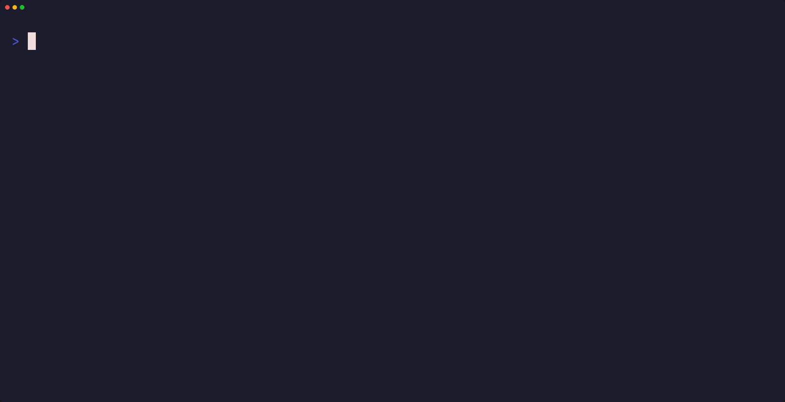

# pgoverlay

[](https://github.com/abd-ulbasit/pgoverlay/actions/workflows/ci.yml)

`git branch` for Postgres: seed once from any running database, then spin up isolated, writable copies that never write back to it.

Each branch is its own Postgres container whose data directory is an **OverlayFS copy-on-write** mount over one shared, read-only seed of the source. Creating a branch mounts that seed instead of copying it: a 5 GiB database branches in **1.89 s**, and a fresh branch holds **under 1 MiB** of its own data (0.4 MiB in the [#49 benchmark](docs/benchmarks.md#throughput-and-the-first-write-stall)). After that, **reads copy nothing** into the branch, and a write copies the file it touches once, or only the blocks it changes where the volumes sit on XFS or btrfs. Branches run side by side, can be reset, diffed against their base, and branched again.



*branching a 1 GiB database, recorded for real (see [docs/benchmarks.md](docs/benchmarks.md))*

## Install

- **Release binaries** (from v1.0.0): `pgb` (CLI), `branchd` (daemon) and `pgoverlay-github` (webhook service) for Linux and macOS, amd64 and arm64, on the [releases page](https://github.com/abd-ulbasit/pgoverlay/releases), with `checksums.txt` and build provenance ([verifying a download](SECURITY.md#release-integrity)).
- **With Go** (1.26.6 or newer):

  ```bash
  go install github.com/abd-ulbasit/pgoverlay/cmd/pgb@latest
  go install github.com/abd-ulbasit/pgoverlay/cmd/branchd@latest
  ```

- **Container images**: `ghcr.io/abd-ulbasit/pgoverlay-branchd` and `ghcr.io/abd-ulbasit/pgoverlay-ghook`, tagged per release. Images from v1.0.0 on are multi-arch (linux/amd64, linux/arm64); the earlier `-rc` images are linux/amd64 only.
- **From source**: `make build` puts all three binaries in `./bin`.

`pgb version` prints what you are running.

## Quickstart

You need Docker (Docker Engine on Linux, or Docker Desktop / Colima on macOS) and `psql`. This walkthrough starts a throwaway source database; skip that part if you already have a Postgres that containers can reach.

```bash
# A demo source. The stock image has no pg_hba entry for remote replication.
docker run -d --name demo-src -e POSTGRES_PASSWORD=secret postgres:17 \
  -c wal_level=replica -c max_wal_senders=4
until docker exec demo-src pg_isready -h 127.0.0.1 -U postgres >/dev/null; do sleep 1; done
docker exec demo-src psql -U postgres \
  -c "CREATE TABLE t(i int); INSERT INTO t SELECT generate_series(1,100000);"
docker exec demo-src sh -c \
  'echo "host replication all all scram-sha-256" >> "$PGDATA/pg_hba.conf"'
docker exec demo-src psql -U postgres -c "SELECT pg_reload_conf();"

# Works on every Docker version (Docker 29 removed .NetworkSettings.IPAddress).
SRC_IP=$(docker inspect -f '{{range .NetworkSettings.Networks}}{{.IPAddress}}{{end}}' demo-src)
export PGPASSWORD=secret   # the source's password; branches inherit its roles

# Seed once, branch many.
pgb source add main --host "$SRC_IP" --user postgres
pgb branch create pr-1 --from main
# branch "pr-1" ready in 2.482s (port 34467)

pgb branch ls
psql "$(pgb connect pr-1)" -c "SELECT count(*) FROM t"            # 100000
psql "$(pgb connect pr-1)" -c "DELETE FROM t WHERE i > 50000"      # only in the branch
docker exec demo-src psql -U postgres -c "SELECT count(*) FROM t"  # still 100000

pgb branch destroy pr-1
pgb source rm main
docker rm -f -v demo-src
```

`--host` must be reachable **from containers**, not just from your shell. For a database on the Docker host itself, use `host.docker.internal` on Docker Desktop and Colima; on Linux Docker Engine that name does not resolve inside containers, so use the `docker0` gateway address (usually `172.17.0.1`) or the host's IP, or put the database on a user-defined network and pass `--network <net>`. State lives in `~/.pgoverlay` (`PGOVERLAY_HOME`). The Docker endpoint comes from `DOCKER_HOST` or your current docker context; `ssh://` contexts are not supported (run pgoverlay on the Docker host instead). The full walkthrough, including the server, is in [docs/quickstart.md](docs/quickstart.md).

> [!IMPORTANT]
> **Honest limits.** Read these before you adopt pgoverlay.
>
> - **It is a dev/test tool.** Branches are disposable Postgres instances for development, CI, review apps and migration rehearsal. There are no backups, no replication of branches and no merge-back, and a branch never follows its source after seeding.
> - **Branch containers are privileged.** On Docker and in Kubernetes hostpath mode every branch container gets `CAP_SYS_ADMIN` with AppArmor unconfined (and seccomp unconfined on Kubernetes), because it mounts its own overlay. Do not give branches to untrusted code. Kubernetes csi mode adds no capabilities. See [docs/security.md](docs/security.md).
> - **On ext4, a write copies the whole file.** Reads copy nothing, but the first time Postgres writes to a table or index file, OverlayFS copies that file (a segment, up to 1 GiB) into the branch, and that write waits for the copy. Postgres usually writes pages out at a checkpoint, so the wait tends to land on the checkpoint, or on a query that evicts the page, rather than on the `UPDATE` (20 s for a 446 MiB segment on the test host). A branch grows by the segments it writes. Where the volumes live on XFS (`reflink=1`) or btrfs, the copy is an extent clone and a write copies only the blocks it changes: branchd detects this at startup, and `--volume-root` puts the volumes on such a disk on any Docker host ([how](docs/concepts.md#8-clone-or-copy-what-a-copy-up-costs)).
> - **Linux 4.19 or later for copy-free reads.** Each branch checks at start that its kernel and image can run the lazyrw shim that keeps reads from copying. Where they cannot, the branch copies every table file it opens, as releases before v1.0.0 did, and says so in its log and in the `pgoverlay_branch_cow_mode` metric ([Troubleshooting](docs/troubleshooting.md#a-branch-copies-eagerly)).
> - **Postgres 14 to 18, Linux containers.** Seeding with `pg_basebackup` needs a `REPLICATION` user and `wal_level=replica` on the source; managed Postgres needs `--via dump`.
> - **One writer.** The registry is a SQLite file owned by one `branchd`. More replicas give failover through leader election, not more throughput.

## What you can do with it

| You want | Use | Read |
|---|---|---|
| Throwaway production-shaped databases on a laptop | `pgb` | [Ways to use it](docs/usage.md#1-local-development) |
| One stable endpoint, a REST API and a web UI for a team | `branchd` | [Run the server](#run-the-server-branchd) |
| An isolated database for every test | `pgoverlaytest` (Go), `pgoverlay-test` (JS), the GitHub Action | [Testing](docs/testing.md) |
| A masked database branch for every pull request | `pgoverlay-github` | [GitHub App](docs/github-app.md) |
| Branches as pods in a cluster | the Helm chart | [Kubernetes](docs/kubernetes.md) |
| To see what a migration did to real data | `pgb diff` | [What changed in a branch?](#what-changed-in-a-branch) |

## Run the server (`branchd`)

`branchd` serves the same engine over a REST API (`:7070`), routes Postgres connections to branches by name (`:6432`), serves a small web UI at `/ui/`, and runs a reconcile loop that reaps expired branches and repairs drift.

```bash
export PGOVERLAY_TOKEN=$(openssl rand -hex 16)   # admin token, at least 16 characters
branchd
# REST API listening on :7070 (TLS false)
# pg router listening on :6432 (connect with dbname@branch; TLS false)
```

Connect to any branch through the router by suffixing the branch name to the database. The router reads the startup message, finds the branch, and from then on relays bytes untouched, so authentication (SCRAM included) happens between your client and the branch, and `Ctrl-C` cancels a query as usual:

```bash
psql "host=localhost port=6432 dbname=postgres@pr-42 user=postgres"
```

The CLI drives a running branchd in server mode:

```bash
export PGOVERLAY_SERVER=http://localhost:7070   # or --server per command
pgb source add main --host "$SRC_IP" --user postgres   # branchd runs the seed
pgb branch create pr-42 --from main --ttl 24h
pgb connect pr-42    # the direct URL (branchd host only) and the router URL
```

Things to know before you expose it:

- Both listeners bind every interface by default and speak plaintext until you add `--api-tls-cert`/`--api-tls-key` and `--pg-tls-cert`/`--pg-tls-key`. Clients trust a private CA with `PGOVERLAY_CA_CERT=<pem file>`.
- Hand out scoped tokens instead of the admin token: `pgb token create ci --role operator` (roles: viewer, operator, admin).
- `--rotate-branch-credentials` gives every branch its own password, encrypted at rest under a key in the state directory (`secret.key`, or `PGOVERLAY_SECRET_KEY` / `--secret-key-file`). Rotating `PGOVERLAY_TOKEN` does not affect stored passwords. Back up `secret.key` together with the registry.
- `--reconcile-interval 60s` sets the reconcile tick (TTL reaping, drift repair, garbage collection), and `--stuck-timeout 10m` is when an abandoned operation is failed. `--default-ttl`, `--max-ttl` and `--max-branches` bound what clients can create.
- Don't run local-mode `pgb` (no `--server`) against the `PGOVERLAY_HOME` a running branchd owns: the registry has one writer.

Every flag, variable and endpoint is in the [reference](docs/reference.md) and [REST API](docs/api.md) pages; [docs/security.md](docs/security.md) is the threat model and hardening checklist.

## Beyond the laptop

**Kubernetes.** A Helm chart runs branchd in-cluster with branches as pods, either on one storage node (hostpath, the default) or as CSI PVC clones that schedule anywhere and need no extra capabilities. [docs/kubernetes.md](docs/kubernetes.md) covers both modes, Pod Security, NetworkPolicies and proxy TLS; [docs/eks.md](docs/eks.md) is a full AWS walkthrough; [docs/ha.md](docs/ha.md) covers leader election.

```bash
kubectl create namespace pgoverlay-system
kubectl label namespace pgoverlay-system pod-security.kubernetes.io/enforce=privileged
helm install pgoverlay deploy/helm/pgoverlay -n pgoverlay-system \
  --set node=<storage-node-name> --set token=$(openssl rand -hex 16)
```

**A branch per pull request.** `pgoverlay-github` receives signed GitHub webhooks and creates `gh-<repo-key>-pr-<number>` when a PR opens (the repository key keeps PRs of different repositories apart), optionally resets it on every push, and destroys it on close. It reports a `pgoverlay/branch` commit status that turns green only once the branch is ready, and keeps one live connect-info comment on the PR. See it on a real pull request: a migration that passes on an empty dev database fails against the PR's masked clone of production (37 legacy duplicate emails), gets fixed, and the branch is destroyed on merge: [pgoverlay-demo PR #1](https://github.com/abd-ulbasit/pgoverlay-demo/pull/1). Setup: [docs/github-app.md](docs/github-app.md).

**Tests.** Every test gets its own branch, destroyed when it ends. Connect through the router (`ProxyDSN`): the direct address only works from the branchd host or inside the cluster.

```go
func TestOrderTotals(t *testing.T) {
    t.Parallel()
    b := pgoverlaytest.Acquire(t)   // skipped when PGOVERLAY_SERVER is unset
    db, _ := sql.Open("pgx", b.ProxyDSN)
    // ...
}
```

In CI, the Action creates the branch and the destroy step cleans it up even when the job fails:

```yaml
- uses: abd-ulbasit/pgoverlay/action@v1
  id: branch
  with:
    server: ${{ vars.PGOVERLAY_SERVER }}
    token: ${{ secrets.PGOVERLAY_TOKEN }}
- run: go test ./...
  env:
    PGHOST: ${{ steps.branch.outputs.proxy_host }}
    PGPORT: ${{ steps.branch.outputs.proxy_port }}
    PGDATABASE: ${{ steps.branch.outputs.proxy_database }}
    PGUSER: ${{ steps.branch.outputs.user }}
- uses: abd-ulbasit/pgoverlay/action/destroy@v1
  if: always()
  with:
    server: ${{ vars.PGOVERLAY_SERVER }}
    token: ${{ secrets.PGOVERLAY_TOKEN }}
    branch: ${{ steps.branch.outputs.branch }}
```

The Action's `proxy_host` input (and `PGOVERLAY_PROXY_HOST` for the SDKs) points at the router when it has its own address, such as the Helm chart's `pgoverlay-proxy` Service. JS, naming and TTL rules: [docs/testing.md](docs/testing.md).

## What changed in a branch?

`pgb diff NAME` (API: `GET /v1/branches/{name}/diff`) compares a branch with the state a reset would return it to: a unified diff of `pg_dump --schema-only`, then per-table row-count changes.

```console
$ pgb diff pr-42
@@ -23,12 +23,31 @@
...
+CREATE TABLE public.audit_log (
+    id bigint NOT NULL,
+    entry jsonb
+);
...
 CREATE TABLE public.t (
-    i integer
+    i integer,
+    note text
 );

TABLE      BASE  BRANCH  DELTA
audit_log  0     1204    +1204
(row counts are planner estimates)
```

The engine starts a temporary branch from the target's recorded base, dumps both, and destroys the temporary branch, so a diff takes a few seconds and never touches the source. Row counts are planner estimates, exact enough to see what a migration did; tables whose count is unknown show `?`, and a small change to a seeded table shows once the branch has analyzed it (`ANALYZE` before the diff). `--all` lists unchanged tables and `--data` samples the new rows. On the overlay backend the base is the branch's fork point; for a branch created from another branch on zfs or csi it is the parent's current state. More in [docs/usage.md](docs/usage.md#5-reviewing-migrations-with-pgb-diff).

## The copy-on-write system that copied the whole database

The first real benchmark said branching a 5 GiB database took **61.9 s** and left a **5.05 GiB** writable layer behind. For a design whose premise is that branches share one base, that is not a slow path; it is the feature not working.

**The diagnosis.** A branch is a stock `postgres` container whose `PGDATA` is an OverlayFS mount: the seeded source read-only below, an empty writable volume on top. The seed comes from `pg_basebackup`, so a branch's first boot is crash recovery, and before replaying any WAL Postgres runs `SyncDataDirectory`. Under the default `recovery_init_sync_method=fsync` that pass opens **every** file in the data directory read-write to fsync it, and on OverlayFS a read-write open of a lower-layer file copies the whole file up. The sync pass copied the entire dataset into the empty layer before the branch served a single query; the WAL replay it prepared for took `0.00 s`. A control run identical except for `-c recovery_init_sync_method=syncfs` finished recovery with the writable layer at **16 KiB**.

**The fix is that flag**, now in the branch entrypoint ([`internal/cow/entrypoint.sh`](internal/cow/entrypoint.sh)): one `syncfs()` per filesystem instead of a per-file pass, which opens nothing read-write, copies nothing up, and syncs a superset of what the per-file pass covered.

| 5.00 GiB database | branch create (p50 of 5) | writable layer after create |
|---|---|---|
| before | 61.9 s | 5.05 GiB |
| after | **1.89 s** | **33.1 MiB** |

Creation no longer depends on database size (1.90 s at 1 GiB, 1.89 s at 5 GiB). The long-form write-up is [**Postgres copied 5 GiB before recovery started**](https://www.basit.engineer/posts/postgres-copied-5gb-before-recovery-started.html).

**The same mechanism was on the read path, until v1.0.0.** Postgres opens relation files `O_RDWR` for every access (`src/backend/storage/smgr/md.c`; checked in `REL_14_STABLE` and `REL_17_STABLE`), so the first query that touched a table copied its files up whole, reads included. The pre-v1 review measured it: a fresh branch at 33.1 MiB, a 1-row `UPDATE` on a small table at 33.5 MiB, and a `SELECT count(*)` on a 489 MB frozen table at 523.1 MiB. `syncfs` fixed branch creation; it could not fix this, because it is how stock Postgres reads.

v1.0.0 fixes it without patching Postgres ([#49](https://github.com/abd-ulbasit/pgoverlay/issues/49)). A small `LD_PRELOAD` library in the branch's Postgres, the lazyrw shim ([`internal/cow/lazyrw`](internal/cow/lazyrw/lazyrw.c)), opens table files read-only and reopens a file read-write on its first write, which is when OverlayFS copies it. And every new seed is recovered, frozen and cleanly shut down once (seed settle), so a read in a branch finds no hint bits to set and no WAL to replay. In the evaluation (Linux 7.0, Docker 29.6.2 on ext4, PostgreSQL 17), a `SELECT count(*)` of a 521 MB frozen table added 555 MiB to a branch and took 20.8 s without the shim, and **0 bytes and 277 ms** with it. Under pgbench, a 60 s select-only run grew a branch by 16.5 MiB (1.6 MiB allocated, mostly its WAL segment) where copying on open grew it by 768 MiB. On dedicated GitHub-hosted runners (5 interleaved rounds each), warm TPC-B with the shim was 1.5% below the eager branch on amd64 (11,648 against 11,823 tps, no round more than 2.6% apart) and 1.7% above it on arm64, and warm select-only was within 1.4% of it on both, so the release gate (select-only within noise, warm TPC-B within 5%) passes. A write still copies the file it touches on ext4; on XFS and btrfs that copy is a clone. [docs/benchmarks.md](docs/benchmarks.md) has every number, the methodology, and the earlier results kept as they were.

## How it works

`pgb source add` runs `pg_basebackup` (or `pg_dump` with `--via dump`) in a one-shot helper container and writes the seed into a volume. It then settles the seed once: another helper starts Postgres on the copy (never on the source), which finishes the backup's recovery, runs `VACUUM (FREEZE, ANALYZE)` on every database, and shuts it down cleanly (`--seed-settle`, default `freeze`). That volume becomes the read-only lower layer of every branch of the source.

`pgb branch create` makes an empty volume for the branch and starts a stock `postgres` container whose entrypoint mounts the overlay **inside the container**, so the same code works on Colima, Docker Desktop and bare Linux:

```
 ┌─ branch container (CAP_SYS_ADMIN) ──────────────────────────┐
 │   PGDATA = /pgoverlay/merged   ← overlayfs mount             │
 │     ┌──────────────────────┐                                │
 │     │ upper+work (writes)  │  volume: pgoverlay-br-pr-1-rw   │
 │     ├──────────────────────┤                                │
 │     │ lower (read-only)    │  volume: pgoverlay-src-main ────┼─▶ shared by
 │     └──────────────────────┘  (the seed)                    │   all branches
 │   postgres + LD_PRELOAD=liblazyrw: table files are opened   │
 │   read-only until their first write                         │
 └─────────────────────────────────────────────────────────────┘
```

Postgres boots on the merged view from the settled seed's clean shutdown, so there is no WAL to replay. Stock Postgres opens table and index files read-write even to read them, and OverlayFS copies a lower file whole into the branch's own volume on its first read-write open. So the entrypoint preloads the lazyrw shim into Postgres, which opens those files read-only and reopens one read-write only when Postgres first writes to it. A read falls through to the shared seed and copies nothing; the first write to a file copies that file (a relation segment, up to 1 GiB) once. When the volumes sit on XFS (`reflink=1`) or btrfs, that copy is an extent clone, taking milliseconds and no space, and later writes copy only the blocks they change. Files a branch never writes stay shared. Each branch checks at start that its kernel and image can use the shim and falls back to copying on open, loudly, when they cannot. Branches are isolated from the source and from each other.

Branching from a branch (`pgb branch create child --from-branch parent`) freezes the parent's writable layer into an immutable shared layer, so the parent is checkpointed, stopped and restarted (about twice the create time of a plain branch). The zfs backend snapshots the parent instead, with no interruption; the csi backend clones the parent's volume after a brief checkpoint and stop.

The Go code is a control plane only: a SQLite registry with a journaled state machine, sagas whose every step registers a compensation (a failed create leaves no containers or volumes behind), and a reconcile loop that converges the registry and the container runtime. The [architecture](docs/architecture.md) page has the details.

## How it compares

All of these give you production-shaped databases faster than a full copy. They differ in what they ask you to run.

| | What it needs | A branch is | Notes |
|---|---|---|---|
| **pgoverlay** (overlay backend) | Docker, or Kubernetes with one storage node | a Postgres container on an OverlayFS view of a shared seed | Any Postgres 14 to 18 as the source; stock images; reads copy nothing, a write copies the file it touches once (only the changed blocks on XFS or btrfs; see limits) |
| **pgoverlay** (zfs / csi backends) | a ZFS pool, or a CSI driver that clones volumes | a Postgres container on a block-level clone | zfs is experimental |
| [DBLab Engine](https://github.com/postgres-ai/database-lab-engine) | a ZFS (or LVM) pool on the host | a Postgres container on a thin clone | Mature, self-hosted, block-level CoW |
| [Neon](https://neon.com) | Neon's service | a copy-on-write branch in Neon's storage engine | The storage is open source, but there is no supported self-hosted path; your data lives in Neon |
| [Supabase branching](https://supabase.com/docs/guides/deployment/branching) | the hosted Supabase platform | a separate Supabase project | Hosted-only |
| [Xata](https://github.com/xataio) (open source) | Kubernetes with CloudNativePG and OpenEBS | a CloudNativePG cluster on a copy-on-write volume | Self-hosted on Kubernetes |
| PostgreSQL 18 `file_copy_method = clone` | a filesystem that can clone files (reflinks: XFS, Btrfs, ...) | a database cloned inside the same instance | No extra software, but every branch shares one server, and the template database must have no other connections while it is copied |
| `pg_dump` / `createdb -T` | nothing | a full copy | Minutes to hours for real datasets; N copies cost N times the disk |

pgoverlay's niche is the middle: plain Docker and stock Postgres images, against the Postgres you already run, with no special filesystem, and block-level copy-on-write when the volumes happen to sit on XFS or btrfs. If you already operate ZFS, DBLab Engine or pgoverlay's zfs backend copy blocks rather than files on any host, which uses less disk for branches that write into many large tables.

## Supported Postgres versions

| Postgres major | 13 and older | 14 | 15 | 16 | 17 (default) | 18 |
|---|---|---|---|---|---|---|
| Supported | ❌ | ✅ | ✅ | ✅ | ✅ | ✅ |

Declare the source's major with `--pg-version` (`"pg_version"` over the API); branches run `postgres:<major>`, and a seed whose data directory reports a different major is refused. A source that needs extensions or locales the stock image lacks names its own image with `--image` (for example `postgis/postgis:17-3.5`). PG 13 and older are unsupported because branch startup relies on `recovery_init_sync_method=syncfs`, added in PG 14. `make matrix` runs seed, branch, verify and destroy per major, and CI runs 14 through 18 weekly.

The lazyrw shim is built for glibc and musl on x86_64 and aarch64, so it loads into the stock Debian and Alpine images and into custom images derived from them. A branch whose image cannot load it copies on open instead and reports why. On PG 18 the branch pins `io_method=worker` while the shim is active, because the shim sees libc calls and not `io_uring` submissions.

## Documentation

The docs are a MkDocs site, built in CI and published at [abd-ulbasit.github.io/pgoverlay](https://abd-ulbasit.github.io/pgoverlay/) (`pip install mkdocs-material && mkdocs serve` to preview locally).

- [Quickstart](docs/quickstart.md): Docker on a laptop, the CLI, `branchd`, the REST API, the router, the web UI.
- [Ways to use it](docs/usage.md): local dev, a database per test, a branch per PR, preview environments, reviewing migrations.
- [Reference](docs/reference.md): every `pgb` command, `branchd` flag and environment variable.
- [REST API](docs/api.md): endpoints, roles, status codes and the `/v1` stability promise.
- [Troubleshooting](docs/troubleshooting.md): failed branches, recovery, reachability, common errors.
- [Security](docs/security.md): threat model and hardening checklist.
- [Benchmarks](docs/benchmarks.md), [Core concepts](docs/concepts.md), [Architecture](docs/architecture.md), [Code tour](docs/code-tour.md), [Design decisions](docs/DESIGN-DECISIONS.md), [Deep dives](docs/deep-dives.md).
- [Kubernetes](docs/kubernetes.md), [Running on EKS](docs/eks.md), [High availability](docs/ha.md), [Observability](docs/observability.md), [GitHub App](docs/github-app.md), [Testing](docs/testing.md), [ZFS backend](docs/zfs.md), [Upgrading to v1.0](docs/upgrading.md), [Changelog](CHANGELOG.md).

## Development

```bash
make build            # bin/pgb, bin/branchd, bin/pgoverlay-github, version-stamped from git describe
make test             # unit tests
make it               # Docker integration tests (PGOVERLAY_IT=1), one package at a time like CI
make k8s-it           # Kubernetes integration tests on a kind cluster (hack/kind-up.sh)
make matrix           # Postgres version matrix (PGOVERLAY_MATRIX_VERSIONS, default "14 18")
make helm-test        # lint and assert the rendered chart
make js-sdk-test      # both JavaScript SDKs
make lint             # go vet
make vuln             # the CI govulncheck gate; make vuln-test tests the gate itself
make check-toolchain  # Dockerfile base images vs go.mod's go directive
make release-check    # validate .goreleaser.yaml
```

[CONTRIBUTING.md](CONTRIBUTING.md) has the setup and conventions.

## How this was built

Most of the commits here carry a `Co-authored-by: Claude` trailer; run `git log --grep='^Co-authored-by: Claude' -i --oneline | wc -l` against `git log --oneline | wc -l` for the current ratio. I build with coding agents running in parallel git worktrees and I review, benchmark, and integrate what comes back. The parts that decided the shape of this project were not generated: the copy-up diagnosis above came from reading `SyncDataDirectory`, instrumenting the writable layer, and running a single-variable control, and [docs/benchmarks.md](docs/benchmarks.md) still carries the numbers that contradicted the project's own thesis, including the read-path measurement that corrected this README. If you want to judge the engineering rather than the tooling, read that file and [docs/deep-dives.md](docs/deep-dives.md).

## Security

Report vulnerabilities privately through [GitHub's private vulnerability reporting](https://github.com/abd-ulbasit/pgoverlay/security/advisories/new); see [SECURITY.md](SECURITY.md). The threat model is in [docs/security.md](docs/security.md).

## License

[Apache-2.0](LICENSE). Copyright 2026 Abdul Basit.
