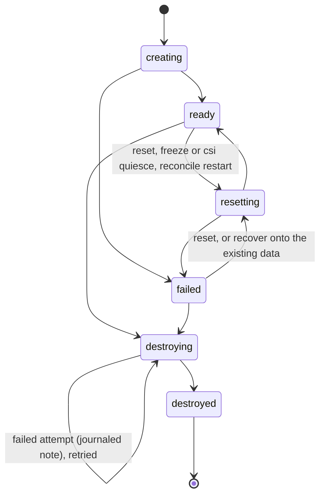

# Architecture (as built)

How pgoverlay actually works — written from the code rather than from the
original design spec, so where the two disagree this document follows the
code. For the file-by-file map of which package does what, see the
[code tour](code-tour.md); for *why* each major structural choice was made,
see the [design decisions](DESIGN-DECISIONS.md).

## Components

```
            pgb (CLI) ────────────────┐
            │ local mode:             │ server mode: REST + bearer token
            │ embeds the engine       ▼
            │                ┌─ branchd ────────────────────────────────┐
            │                │  REST API :7070   (+ embedded web UI)    │
            │                │  pgproxy :6432    (wire-protocol router) │
            │                │  reconcile loop   (reap, repair, GC)     │
            │                └──────────────┬────────────────────────────┘
            ▼                               ▼
        ┌─ engine ──────────────────────────────────┐
        │  sagas: create/from-branch/reset/recover/   │
        │  destroy; diff; masking                     │
        │  cow.Planner: overlay | zfs | csi (names,    │
        │  entrypoints, zfs argv, clone plans)        │
        └───────┬──────────────────────┬────────────┘
                ▼                      ▼
        registry (SQLite)      runtime.Driver
        states + journal       ├─ DockerDriver (containers, volumes)
        sources, branches,     └─ KubeDriver   (pods; hostPath dirs on one
        layers, mask scripts,                   storage node, or CSI PVCs)
        tokens
```

One engine, two frontends: the CLI embeds it directly (local mode), branchd
serves it over REST and the CLI becomes a thin API client (server mode). The
registry is SQLite — a single writer. branchd runs as one replica by default;
with leader election ([High availability](ha.md)) extra replicas stand by and
only the leader writes. Local mode must not run against a registry a branchd
is using.

## The CoW mechanism (overlay backend, default)

`pgb source add` runs `pg_basebackup` in a one-shot helper container,
streaming the source cluster into a named volume — that volume is the
read-only **lower layer** for every branch. `pgb branch create` makes one
empty volume for the branch's writes and starts a stock postgres container
whose entrypoint assembles an OverlayFS mount *inside the container*:

```
 ┌─ branch container (CAP_SYS_ADMIN) ──────────────────────────┐
 │   PGDATA = /pgoverlay/merged   ← overlayfs mount             │
 │                ▲                                            │
 │     ┌──────────┴───────────┐                                │
 │     │ upper+work (writes)  │  volume: pgoverlay-br-pr-1-rw   │
 │     ├──────────────────────┤                                │
 │     │ lower (read-only)    │  volume: pgoverlay-src-main ────┼─▶ shared by
 │     └──────────────────────┘  (pg_basebackup snapshot)      │   all branches
 │   entrypoint.sh: mount overlay → exec docker-entrypoint.sh  │
 └─────────────────────────────────────────────────────────────┘
```

Mounting in-container (not on the host) is what makes the same code work on
Colima/macOS and bare Linux. Postgres boots on the merged view and performs
ordinary WAL crash recovery, as if the machine power-cycled at backup time.

One non-obvious flag is load-bearing: the entrypoint execs postgres with
`-c recovery_init_sync_method=syncfs`. The default (`fsync`) opens every data
file read-write before recovery, and a read-write open of a lower-layer file
forces a full OverlayFS copy-up — i.e. a complete copy of the database into
the branch's rw layer. `syncfs` replaces that per-file pass with one syscall
and copies nothing up; it's what makes branch creation O(1) in data size
(measured in [Benchmarks](benchmarks.md)).

The same rule still applies after startup. Postgres opens every relation
segment read-write, for reads too (`md.c`), so the first query that touches a
table copies each of its segment files (up to 1 GiB) whole into the branch's
rw layer. A branch's disk therefore grows toward the size of the tables it
touches, read or write ([Reads copy up too](benchmarks.md#reads-copy-up-too));
the zfs and csi backends copy blocks instead.

Every branch container gets `CAP_SYS_ADMIN` and `apparmor=unconfined` for the
mount, on Docker whatever the backend. Branch ports are published on the
Docker host's `127.0.0.1`: branchd picks a free loopback port and pins it, and
containers restart with the daemon (`unless-stopped`), so the address survives
Docker and host restarts.

### Seeding: basebackup vs dump

The seed itself has two methods. `pg_basebackup` (default) is a physical,
crash-consistent copy: fast at size, but it requires `REPLICATION` privilege
and a physical replication connection, which managed providers (Supabase,
Neon, RDS, Cloud SQL) don't offer — and branches replay WAL on first start,
as if the machine power-cycled at backup time. `--via dump` is a logical
copy: a helper container runs `initdb` into the seed volume and pipes
`pg_dump` from the remote into it, needing only a normal user, optionally
scoped to schemas (`--dump-schema`). It is slower for large databases (full
SQL restore, index rebuilds), but the resulting layer is a clean-shutdown
cluster, so branches skip crash recovery entirely. Either way the seed is
just a data dir in the source layer — everything downstream (overlay/zfs/csi
branching, refresh generations, masking) is identical.

A basebackup of a standby is made safe to boot: the seed deletes the standby
and recovery signal files and strips the recovery settings, and the branch
entrypoints override the settings that would tie a branch to the source host
(port, listen and socket addresses, `hba_file`, archiving, synchronous
standbys). The seed helper also checks the data directory's major version
against the image and fails a mismatched seed. Each source can name its own
image (`--image`) for extensions, locales or libc the stock
`postgres:<major>` image lacks.

## The zfs backend (experimental)

`branchd --cow zfs --zfs-dataset tank/pgoverlay` swaps the layer mechanics:
sources seed into datasets (`<prefix>/src-<name>-gN`), branch create is
`zfs snapshot` + `zfs clone` (block-level CoW — no copy-up problem, no
overlay assembly; the entrypoint shrinks to perms + pid cleanup + exec), and
zfs commands run in privileged helpers with `/dev/zfs` mapped in. Same
engine, same sagas — `cow.Planner` decides what the driver is asked to do.
Details and verification walkthrough: [ZFS backend](zfs.md).

## Sagas and states

Branch rows move through a journaled state machine (`legalBranch` in
`internal/registry/registry.go`); every transition is a compare-and-swap
written together with its journal row, and records the actor:



`failed` is not terminal: `pgb branch reset` re-clones a failed branch (for a
failed create, a retry), and `pgb branch recover` restarts it on its recorded
volumes with no re-clone — the way back for a branch that failed with its data
intact, such as a freeze parent interrupted by a crash. A destroy that fails
part-way leaves the row in `destroying` with a journaled note, and running the
destroy again (by hand, or reconcile's `retry_destroy`) re-runs the idempotent
teardown. A resetting branch that is destroyed is first moved to `failed`.
Sources have a smaller machine: `seeding → ready | failed`; a failed seed is
replaced by the next `source add` of the same name.

Provisioning is a **saga**: each step (layer create, entrypoint install,
container start, readiness wait, masking) registers a compensation, and any
failure unwinds them in reverse — no orphaned containers, volumes, or
datasets. While a saga runs it heartbeats its rows (every
`min(--stuck-timeout/4, 30s)`), so reconcile can tell a slow operation from
an abandoned one. Masking scripts (per-source ordered SQL, stored in the
registry) run inside the fresh branch via `psql` over the local socket
*after* readiness and *before* the branch is marked ready, so a branch never
serves unmasked data; a failing script fails the branch. Failure reasons are
stored without Postgres `DETAIL`/`CONTEXT` lines (which can quote row data)
and capped at 1 KiB.

The **reconcile loop** runs one pass at startup and then every
`--reconcile-interval`. It reaps expired branches; fails `creating`/`resetting`
branches and `seeding` sources that have made no progress for
`--stuck-timeout` (so a crash less than that ago is repaired by a later pass,
not the startup one); retries destroys stuck in `destroying`; restarts ready
branches whose container or pod is gone and records moved addresses; removes
orphaned containers and finished helpers; and garbage-collects unreferenced
layers and volumes older than `--stuck-timeout`. Every destructive step is
re-checked against the registry just before it runs. The action list is in
[Troubleshooting](troubleshooting.md#what-reconcile-does).

## Source generations

`pgb source refresh` seeds a **new** layer (`...-g2`, `-g3`, …) and bumps the
source's generation. Existing branches keep the layer they were cloned from;
new branches use the new one. An old generation is garbage-collected when the
last branch referencing it is destroyed. Branches never follow the source —
a branch is a point-in-time snapshot by design.

## Per-branch credentials

By default a branch **inherits its source's credentials**: the data
directory is a byte-for-byte clone, so the same role/password just works.
`branchd --rotate-branch-credentials` (chart: `rotateBranchCredentials`)
switches to per-branch passwords: on every branch create and reset the
engine generates a 32-hex `crypto/rand` secret and applies it inside the
branch — `ALTER ROLE … WITH PASSWORD` over the same local-socket psql path
masking uses, after masking and before the branch is marked ready — then
stores it on the branch row (registry v7), encrypted with AES-256-GCM under a
dedicated at-rest key (`secret.key` in the state directory, or
`PGOVERLAY_SECRET_KEY`; see [Security](security.md#the-registry-and-the-at-rest-key)).
The API returns it as `password` (omitted in inherit mode), `pgb connect`
embeds it in the printed DSNs, and `pgb branch ls` never shows it. A password
the configured key cannot decrypt is reported as `password_unavailable`
instead of failing the row; a reset mints a new one. Branch-from-branch
children get their own password; the parent's freeze/quiesce restart
deliberately does not re-rotate (its data already carries its password), and
neither does a recover. A reset rotates again — the old branch password stops
working. A destroyed branch's row keeps no password.

The trade-off: with rotation a leaked branch DSN exposes only that branch,
never the production-shaped source. But static-credential preview flows
break — Vercel-style env templating (one `DATABASE_URL` template with the
branch name substituted per preview) relies on every branch accepting the
same source password, so those flows need inherit mode (the default).

## Branch diff

`DiffBranch` answers "what changed in this branch?" without ever touching
the source: it provisions an internal **throwaway branch** (`diff-<6 hex>`)
from the target's *own* recorded base — whatever a reset of the target would
re-provision onto, never the source's current generation. Both instances are
then dumped in-container over the local socket
(`pg_dump --schema-only --no-owner --no-acl`, plus a table-statistics query),
the unified diff is computed host-side (a linear-space Myers diff), and the
throwaway is destroyed through the normal branch-destroy path. The throwaway
is a regular registry row with a one-hour TTL, so if branchd dies mid-diff
the reaper (or reconcile) cleans the stray.

What "the base" is depends on the backend:

- **overlay**: the pinned source-generation volume and frozen-layer chain,
  so the baseline is exactly what the branch started from;
- **zfs and csi, for a branch created from another branch**: the parent's
  live dataset or PVC. The diff (like a reset) therefore compares against the
  parent's **current** state, and changes the parent made after the fork show
  up reversed. On csi the parent is quiesced around the clone (CHECKPOINT,
  stop, clone, restart) because cloning an in-use PVC is not crash-safe, and a
  child whose parent was destroyed can no longer be diffed or reset.

Row counts are planner estimates (`pg_class.reltuples`); a table never
analyzed is counted exactly when its heap is 64 MiB or less, and otherwise
reported as unknown. Deltas show direction and magnitude, not an audit.
Tables are keyed by schema and name. Optional sampling
(`?data=N`, at most 500 rows per table) returns branch-only rows of grown
tables by primary key.

## Proxy routing

Per-branch host ports are annoying, so branchd bundles a wire-protocol
router. Clients connect to `:6432` with the branch name suffixed to the
database name:

```
 psql "dbname=postgres@pr-42" ──► pgproxy reads the startup message,
                                  resolves pr-42 → container host:port
                                  (registry lookup), rewrites dbname back
                                  to "postgres", then splices bytes
```

Everything after the startup message — including SCRAM authentication — is
relayed untouched between client and branch. With `--pg-tls-cert/--pg-tls-key`
the router answers `SSLRequest` with `'S'` and terminates TLS before reading
the startup message (`sslmode=require` works); without certs it answers `'N'`
as before. The REST API gets the same treatment via `--api-tls-*`.

While relaying the backend's startup response the router records its
`BackendKeyData`, so a `CancelRequest` (psql's `Ctrl-C`, a driver's cancel)
is forwarded to the backend of the one live session holding that key;
unknown or ambiguous keys are dropped. The map is per branchd process, so with
several replicas a cancel must reach the replica carrying the session. The
router is also an unauthenticated surface, so it bounds each connection's
startup (first byte in 2 s, startup in 10 s, backend `ReadyForQuery` in
30 s), caps connections (256) and per-IP startups (64), closes sessions idle
in both directions for 15 minutes, and refuses every routing failure with the
same message. After a failed dial it re-reads the branch's address once
(rate-limited) in case the branch moved. Details in [Security](security.md).

## Branch-from-branch: the layer DAG

`pgb branch create child --from-branch parent` snapshots a **running branch**.
Overlay mode can't snapshot a live upper dir atomically, so the engine
*freezes* it: `CHECKPOINT` on the parent, stop its container, the parent's
current rw volume becomes an immutable **layer** row in the registry, the
parent restarts on a fresh rw volume layered above it, and the child starts
on its own fresh rw volume with the same lower chain. Both now share the
frozen layer read-only:

```
 parent:  [new upper]──┐
                       ├──► frozen layer (old upper) ──► source data
 child:   [new upper]──┘         (refcounted)
```

`PGOVERLAY_LOWERS` carries the chain newest-first; frozen layers contribute
their `/upper` subdir, the source its `/data`. Layers are garbage-collected
when the last branch whose chain references them is destroyed — destroying
the parent first leaves the child (and the layer) intact. ZFS and CSI modes
skip the freeze machinery entirely: they snapshot/clone at the block or
volume level (ZFS: `zfs snapshot` + `clone`, with no parent interruption;
CSI: PVC clone after a brief parent CHECKPOINT and stop, then the parent
restarts).

Overlay chains only grow: each fork of a parent adds a layer, a reset keeps
the chain, and there is no compaction yet. Branch-from-branch is refused
(`403`) once the parent's chain reaches `--max-layer-depth` (default 100).

## Kubernetes: storage-node and CSI models

The kube driver has two storage strategies. **hostPath** (default) maps
"volumes" to subdirectories of a data root (default `/var/lib/pgoverlay`) on
one designated **storage node**; helpers are one-shot pods and branches are
plain pods, all pinned with `nodeName`, branch pods carrying `SYS_ADMIN` (and
unconfined seccomp and AppArmor) for the overlay mount. **csi**
(`--kube-storage csi`) makes every volume a PVC and every branch a PVC
*clone* (`dataSource`, or VolumeSnapshot+restore when a snapshot class is
configured): branch pods need no `SYS_ADMIN`, no node pin — they schedule
anywhere, which is the multi-node payoff. The trade-off: clone CoW economics
belong to the CSI driver (instant on EBS/Ceph/zfs-localpv, full copy on naive
drivers). Either way: no CRDs, no operator — branchd is a normal Deployment
with a namespace-scoped Role: pods create/delete/get/list/watch,
`pods/exec`, `pods/log`, and Secrets create/delete (helper pods read their
environment, including a seed's source password, from a short-lived Secret
instead of the pod spec), plus PVCs and VolumeSnapshots in csi mode and
Leases and pod `patch` with leader election. Helper pods carry the
`pgoverlay.instance` label and an ownerReference to branchd's own pod, so
Kubernetes garbage-collects them if branchd dies mid-seed.

## What runs where

| concern | mechanism |
|---|---|
| data files | only ever touched **inside containers** (helpers/entrypoints) |
| host Go code | pure control plane: registry, sagas, driver API calls |
| seeding | `pg_basebackup` or `pg_dump` helper, runs as the image's `postgres` uid:gid (999:999 Debian, 70:70 Alpine) |
| masking, credential rotation, diff dumps | exec into the branch (as `postgres` on Docker, as root on Kubernetes) |
| disk usage | `du -sb` helper on the rw layer (zfs: `zfs list -o used`) |
| web UI | single static page, `go:embed`, no build toolchain |
| GitHub App | separate `pgoverlay-github` service driving the REST API |
