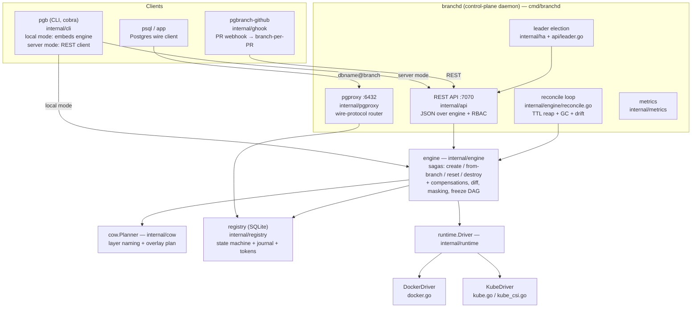
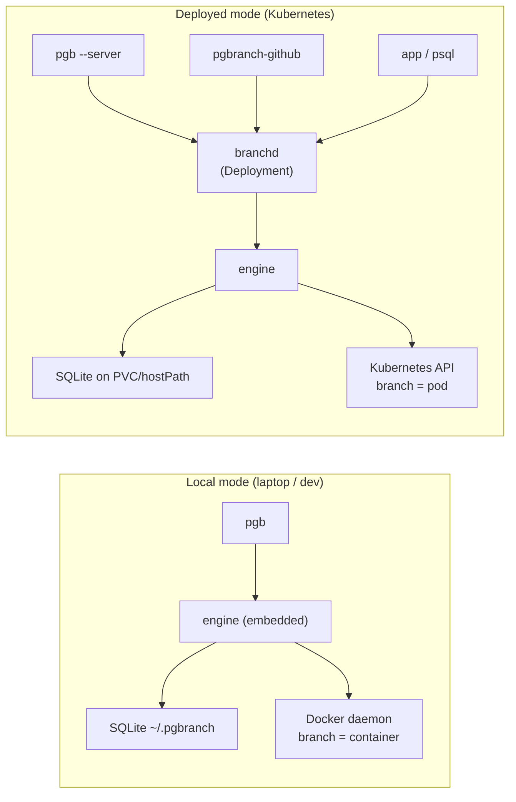
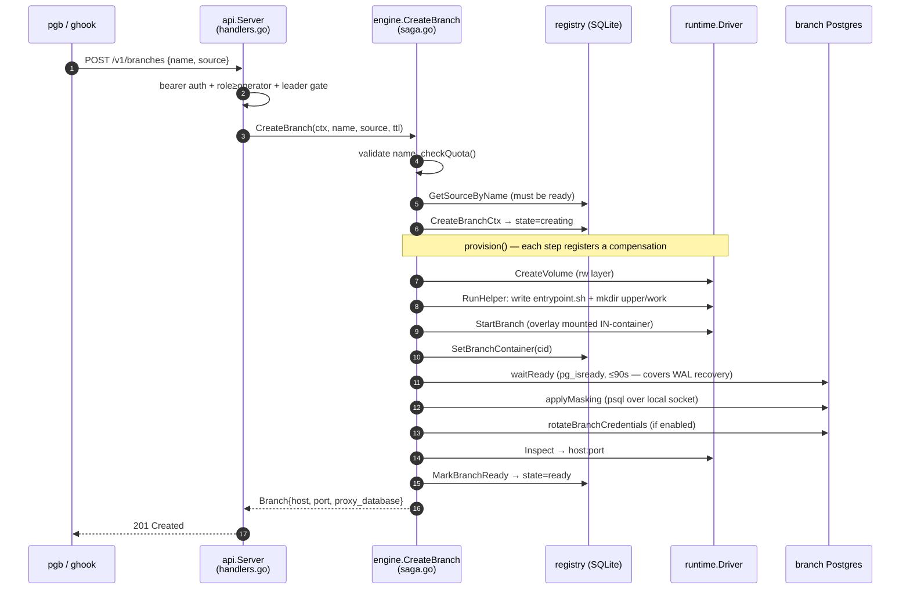
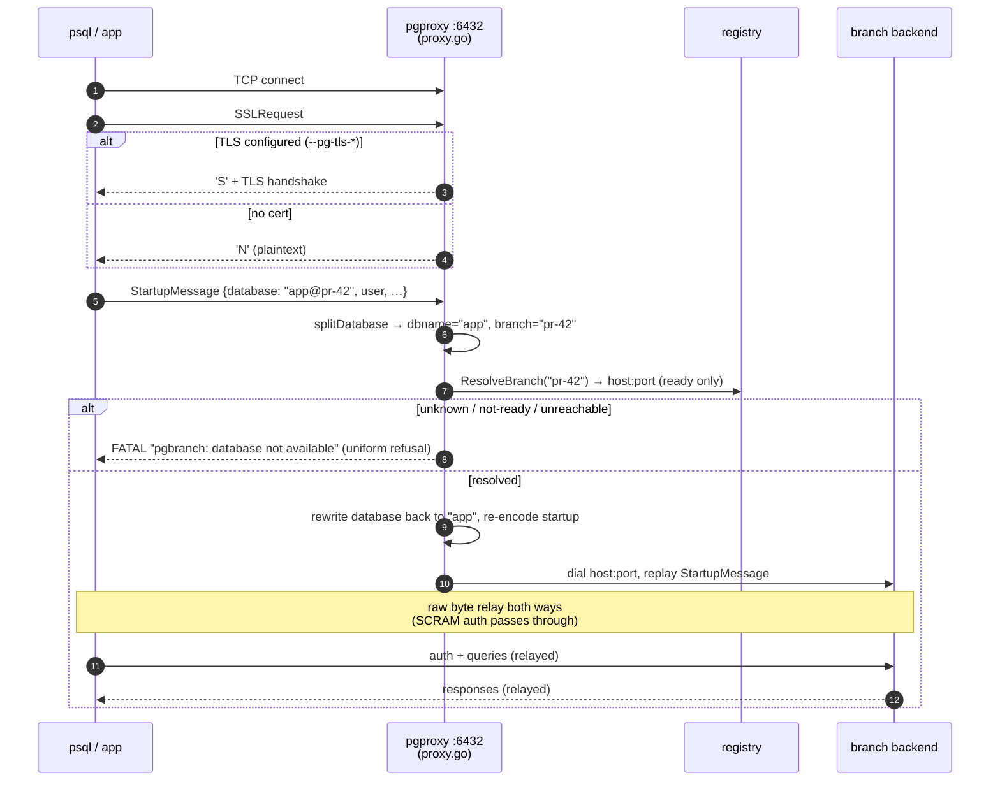
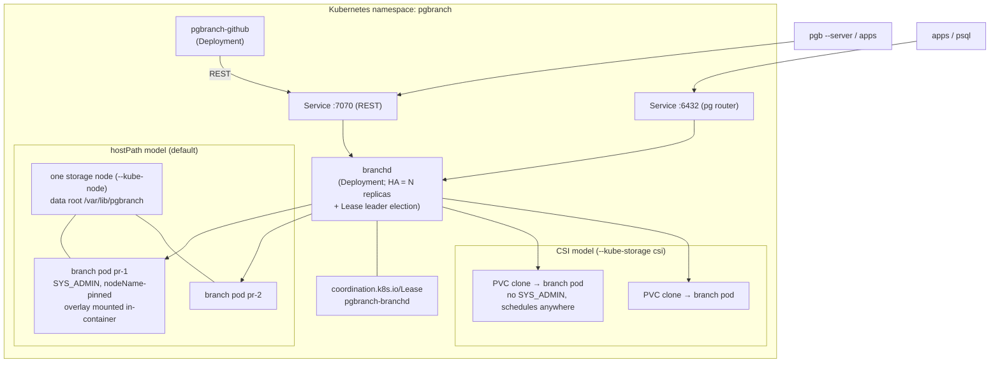

# Code tour

A package-by-package map of the codebase for an engineer who has not read it
yet: what each component owns, how the two run modes differ, and the two request
paths that matter most — creating a branch, and connecting to one. Every claim
cites the file it comes from, so you can read along in the source. Module:
`github.com/abd-ulbasit/pgbranch`, Go 1.26.

If you want the prose overview instead, read [architecture](architecture.md)
first; for the reasoning behind the structure, see
[design decisions](DESIGN-DECISIONS.md).

---

## 1. The one-paragraph mental model

pgbranch gives every git branch / pull request its own **instant, isolated,
production-shaped Postgres database** — Neon-style branching, but self-hosted on
your own Docker host or Kubernetes cluster. The trick is **copy-on-write**: you
seed a source database *once* into a read-only base layer, and each "branch" is
a thin writable layer stacked on top of that shared base. Creating a branch
copies *no data* — it mounts the shared base read-only and gives the branch an
empty scratch layer for its writes — so branch creation is O(1) in database
size instead of O(data). A branch is a real Postgres instance (a container/pod)
that boots on the merged view; you connect to it like any Postgres. The whole
system is a thin **control plane in Go** that never touches data files from the
host — all data operations happen *inside* containers — plus a tiny SQLite
metadata store and a pluggable copy-on-write backend (OverlayFS, ZFS, or
Kubernetes CSI clones).

The "instant cheap branch" insight, made concrete: see
`internal/engine/saga.go` (the create saga) and `internal/cow/plan.go` (how the
overlay layers are named and stacked). The default overlay backend's one
load-bearing detail — `recovery_init_sync_method=syncfs` in the in-container
entrypoint, which is what stops Postgres from copying the whole DB up on first
boot — is documented in `docs/architecture.md`.

---

## 2. Components & responsibilities

One sentence per box, then a short subsection each.

### `cmd/pgb` → `internal/cli` — the CLI

`cmd/pgb/main.go` is a 13-line shim that calls
`cli.NewRootCmd().Execute()`. The real CLI lives in `internal/cli/root.go`
(cobra commands: `source`, `branch`, `connect`, `diff`, `history`, `doctor`,
`gc`, `token`). It has **two modes**, chosen by the `--server` flag /
`PGBRANCH_SERVER` env:

- **Local mode** (`--server` unset): `open()` in `root.go` builds an `engine`
  directly over a Docker driver and the local SQLite registry — the CLI *is*
  the engine. Construction is lazy (inside each command's `RunE`) so `--help`
  and tests never touch Docker.
- **Server mode** (`--server http://branchd:7070`): `serverClient()` returns an
  `apiclient.Client` and the CLI becomes a thin REST caller; the token comes
  from `PGBRANCH_TOKEN`.

Depends on: `internal/engine`, `internal/registry`, `internal/runtime`
(local) or `internal/apiclient` (server).

### `cmd/branchd` — the control-plane daemon

`cmd/branchd/main.go` is the long-running daemon. One `run()` builds a single
`engine` + `registry` and starts several goroutines under an `errgroup`
(`golang.org/x/sync/errgroup`):

1. **REST API** on `--api-addr` (default `:7070`) — `internal/api`.
2. **Postgres wire-protocol router** on `--pg-addr` (default `:6432`) —
   `internal/pgproxy`.
3. **Reconcile loop** — `engine.RunReconcile` on a ticker (`--reconcile-interval`,
   default 60s).
4. Optionally **leader election** (`--leader-elect`, kube only) — `internal/ha`.

It wires `internal/metrics` into the engine and serves `/metrics`, and it
encrypts branch passwords at rest with a key derived from `PGBRANCH_TOKEN`
(`reg.SetSecretKey(registry.DeriveSecretKey(token))`). Storage backend selection
(`--runtime` docker|kube, `--cow` overlay|zfs|csi, `--kube-storage`
hostpath|csi) is validated in `resolveStorage`. Graceful shutdown closes the
listeners but **leaves branch containers running** — they are durable state.

### `cmd/pgbranch-github` → `internal/ghook` — the GitHub App webhook receiver

`cmd/pgbranch-github/main.go` boots an HTTP server; the logic is in
`internal/ghook/service.go`. It receives GitHub `pull_request` webhooks
(`POST /webhook`), verifies the HMAC-SHA256 signature in constant time
(`verifySignature`), and maps PR lifecycle to branches via the REST API
(`internal/apiclient`):

- `opened` / `reopened` / `synchronize` → ensure a branch exists (`handleEnsure`
  → `ensureBranch`); `synchronize` optionally resets it (`ResetOnPush`).
- `closed` → destroy the branch (`handleClosed`).

Branch names are namespaced under a reserved `gh-` prefix
(`gh-pr-<n>` or `gh-<sanitized-ref>`) so a webhook can never collide with a
human-created branch. When GitHub App / PAT creds are configured it posts a
`pgbranch/branch` commit status and keeps a live PR comment with the connect
string (and, with `DiffOnPush`, a schema/data diff). Webhook deliveries are
acked immediately and the branch op runs **detached** (a 5-minute background
context) because GitHub abandons deliveries after ~10s but provisioning at pod
speed can take longer (`dispatch`).

Depends on: `internal/apiclient`, `internal/api` (wire types),
`internal/ghook/githubapp.go` (App auth: per-installation tokens).

### `internal/engine` — the brains

The orchestration layer. `engine.go` defines the `Engine` struct (it holds a
registry, a runtime driver, a `cow.Planner`, plus options for credential
rotation, max-branches quota, TTL policy, and metrics). Everything mutating a
branch is a **saga** with compensations:

- `saga.go` — `CreateBranch`, `ResetBranch`, `DestroyBranch`, and the shared
  `provision` step that fans out to overlay / `provisionZFS` / `provisionCSI`.
- `freeze.go` — `CreateBranchFrom` (branch-from-branch): the frozen-layer DAG.
- `diff.go` — `DiffBranch` (throwaway branch from the same recorded base, dump
  both, diff host-side).
- `reconcile.go` — `PlanReconcile` / `ApplyReconcile` / `RunReconcile`.
- `csi.go`, `zfs.go` — the non-overlay copy-on-write provisioning paths.

Depends on: `internal/registry`, `internal/runtime`, `internal/cow`,
`internal/pgctl` (seeding), `internal/metrics`.

### `internal/registry` — SQLite metadata store

Pure-Go SQLite (`modernc.org/sqlite`, no cgo). It owns the **state machine**
(branches move `creating → ready → resetting → ready`, plus `destroying →
destroyed` and `failed`), the **transitions/audit journal** (who did what —
`actor` column), **sources** and their generations, **frozen layers**, **mask
scripts**, and **hashed API tokens**. Schema is versioned via
`PRAGMA user_version`; `schema.go` holds the migration list — currently **v11**
(see `migrations` in `internal/registry/schema.go`). Crucially SQLite is a
**single writer**, which is why branchd is single-replica for writes (HA elects
one leader) and you must not run local-mode `pgb` against a registry a `branchd`
is using.

### `internal/runtime` — the `Driver` interface

`runtime.go` defines `Driver`: `CreateVolume`, `RemoveVolume`, `CloneVolume`,
`RunHelper` (one-shot data containers), `StartBranch` (the long-lived branch
Postgres), `Exec`/`ExecOutput`, `Inspect`, `StopRemove`, `ListManaged`,
`ListManagedVolumes`. Two implementations:

- **`docker.go`** — `DockerDriver`: named volumes + containers, branches
  published on `127.0.0.1`.
- **`kube.go` / `kube_podspec.go` / `kube_csi.go`** — `KubeDriver`: branches as
  pods, two storage strategies (hostPath on one node, or CSI PVC clones).

Every managed resource is labelled `pgbranch.instance=<id>` (see
`LabelInstance`) so reconcile only ever reclaims resources belonging to *its*
registry.

### `internal/cow` — copy-on-write planning (pure, no I/O)

`plan.go` decides volume/layer **names** and the **overlay stack order**; the
overlay mount itself happens *inside* the branch container via an embedded
entrypoint script (`//go:embed entrypoint.sh`). `PlanBranch` lays out the
lowerdirs (frozen layers newest-first, source last) and renders
`PGBRANCH_LOWERS`. The `Planner` also produces the exact `zfs` argv the engine
runs in privileged helpers, and the source/branch layer names for every backend.

### `internal/pgctl` — seeding helpers

`seed.go` (`pg_basebackup`) and `seeddump.go` (`pg_dump`) run the source copy
**through the runtime driver** as one-shot helper containers — pgbranch never
touches data files from the host. `pg_basebackup` is physical/crash-consistent
(needs `REPLICATION`); `pg_dump` is logical (works against managed Postgres like
RDS/Neon/Supabase that forbid physical replication).

### `internal/apiclient` — the Go REST client

`client.go` — a thin typed client over branchd's `/v1` API, used by the CLI in
server mode and by ghook. Speaks the wire types defined in `internal/api`.

### SDKs and the GitHub Action

- `pgbranchtest/` (Go) — spin up an ephemeral branch in a test, get a DSN, tear
  it down. `pgbranchconnect/` (Go) — resolve a connect string at runtime.
- `sdk/js` and `sdk/js-connect` — JS equivalents (`index.mjs` + `.d.ts`).
- `action/` — a composite GitHub Action (`action.yml` + `entrypoint.sh`, plus a
  separate `action/destroy`) for CI pipelines.

---

## 3. The two ways it runs

pgbranch is **one engine with two frontends**. The same `engine` code runs in
both modes; only what wraps it changes.

- **Local**: `pgb` embeds the engine (`cli/root.go: open()`), uses the Docker
  driver, and writes the SQLite registry under `~/.pgbranch`. Great for a single
  developer. Because SQLite is single-writer, you must not run this while a
  `branchd` shares the same registry.
- **Deployed**: `branchd` runs as a normal Kubernetes Deployment (no CRDs, no
  operator — `docs/architecture.md`), owns the registry, and exposes the REST
  API + the Postgres router. `pgb` (with `--server`) and `pgbranch-github`
  become REST clients; apps connect through the proxy. HA runs multiple
  replicas with leader election so only one accepts writes.

---

## 4. End-to-end: what happens when you create a branch

Two entry points converge on the same saga: `pgb branch create` (or a REST
`POST /v1/branches`) and a PR webhook. Below is the deployed path through
branchd; the steps in `engine` are identical in local mode.

Walking each step with the file that does it:

1. **Auth & gate** — `internal/api/middleware.go` checks the bearer token and
   minimum role; `s.mutate(operator, …)` in `api/server.go` also composes the
   HA leader gate (`api/leader.go`), so non-leaders return `503 not leader`.
   The handler is `createBranch` in `internal/api/handlers.go`.
2. **Validate + quota** — `CreateBranch` in `internal/engine/saga.go` calls
   `validateBranchName` (anchored regex `^[a-z0-9][a-z0-9-]{0,40}$`, which also
   blocks path-traversal because names flow into volume/dataset/container
   names) and `checkQuota` (`--max-branches`, returns `ErrQuotaExceeded` → 403).
3. **Resolve source** — `reg.GetSourceByName`; the source must be in state
   `ready` (`registry`).
4. **Insert the row** — `reg.CreateBranchCtx` writes a branch row in state
   `creating`, pinning `SourceVolume` (the source's *current* generation
   volume) and naming the rw volume via `planner.BranchLayerName`.
5. **Provision (the saga body)** — `provision` in `saga.go`. For the overlay
   backend it builds a `cow.Plan` from the layer chain, then runs steps that
   each push a compensation onto an `undo` stack:
   - **rw volume** — `drv.CreateVolume`. Compensation: `RemoveVolume`.
   - **entrypoint install** — `installOverlayEntrypoint` runs an Alpine helper
     that writes `cow.EntrypointScript` into the rw volume and creates
     `upper/` and `work/`.
   - **start branch** — `startOverlayBranch` mounts the source `ro` at
     `/pgbranch/lower0`, frozen layers `ro` at `/pgbranch/lower1..N`, the rw
     volume at `/pgbranch/rw`, sets `PGDATA=/pgbranch/merged` and
     `PGBRANCH_LOWERS`, and runs the entrypoint that assembles the OverlayFS
     mount *inside the container* and execs Postgres. Compensation:
     `StopRemove`.
   - If any step fails, `fail()` unwinds the `undo` stack in reverse — **no
     orphaned volumes or containers, ever**.
6. **Readiness + masking + credentials** — `awaitAndMark` (saga.go):
   `SetBranchContainer` first (so a concurrent reconcile treats the in-flight
   container as owned, not an orphan), then `waitReady` (`pg_isready` loop,
   90s budget — this is where WAL crash recovery happens for basebackup
   seeds), then `applyMasking` (per-source SQL via in-container `psql` over the
   local socket, so the branch never serves unmasked data), then optional
   `rotateBranchCredentials`.
7. **Address + mark ready** — `inspectAddr` polls `drv.Inspect` until a routable
   host:port appears (k8s pod IPs lag exec-readiness), then
   `reg.MarkBranchReadyCtx` flips the row to `ready` and records host/port.
8. **Response** — the handler returns a `Branch` including `proxy_database`
   (`dbname@branch`), so the caller knows how to connect through the router.

The **PR-webhook path** reaches the same place: `ghook/service.go:ensureBranch`
calls `apiclient.CreateBranch` → `POST /v1/branches` → the saga above.

---

## 5. Connecting to a branch — the pgproxy flow

Per-branch host ports are annoying to track, so branchd bundles a
**Postgres wire-protocol router** (`internal/pgproxy/proxy.go`). You connect to
`:6432` and put the branch name in the database parameter as
`dbname@branchname`. The proxy resolves the branch, rewrites the database back
to its real name, and then splices raw bytes — **SCRAM authentication flows
through untouched** because the proxy never participates in auth.

Step by step (all in `internal/pgproxy`):

- **Accept & startup phase** — `handleConn` answers `SSLRequest` with `'S'` and
  a TLS upgrade when `TLSConfig` is set (`--pg-tls-cert/--pg-tls-key`), else
  `'N'`. `GSSEncRequest` is answered `'N'`; `CancelRequest` is dropped silently.
  A `StartupTimeout` (10s) bounds the whole phase so a client that connects and
  dribbles can't pin a goroutine forever.
- **Parse the StartupMessage** — `route` reads `startup.Parameters["database"]`
  and `splitDatabase` (`startup.go`) splits on the **last** `@` into
  `dbname` and `branch`. No `@` → `3D000 invalid_catalog_name` refusal.
- **Resolve** — `RegistryResolver.ResolveBranch` looks the branch up in the
  registry and returns `host:port` **only if the branch is `ready`**. Unknown
  name, not-ready, dial failure — all collapse to the same generic refusal
  (`genericRouteRefusal`) so an unauthenticated client can't enumerate branch
  names or probe state. The real reason is logged server-side.
- **Rewrite & relay** — the proxy sets `database` back to the real `dbname`,
  re-encodes the startup message, dials the backend, writes the rewritten
  startup, then `relay()` copies bytes in both directions with an
  `IdleTimeout` (15m). Everything after the startup message — including the
  SCRAM challenge/response — is opaque to the proxy.

Backend dials are always plaintext (branches are local/cluster-internal);
client-facing TLS is the security boundary.

---

## 6. Deployment topology

In Kubernetes, branchd is a plain Deployment with a namespace-scoped Role — no
CRDs, no operator. Branch pods are created directly via the Kubernetes API by
the `KubeDriver`. There are two storage models.

- **hostPath (default)** — "volumes" are subdirectories of `--kube-data-root`
  (default `/var/lib/pgbranch`) on one **storage node** named by `--kube-node`;
  helper pods are one-shot, branch pods are plain pods, all pinned with
  `nodeName`, and branch pods carry `SYS_ADMIN` for the in-container overlay
  mount (`internal/runtime/kube.go`). Single-node scope, but works on any
  cluster.
- **CSI (`--kube-storage csi`)** — every volume is a **PVC** and every branch is
  a **PVC clone** (`dataSource`, or VolumeSnapshot+restore with a snapshot
  class). Branch pods need no `SYS_ADMIN` and no node pin, so they schedule
  anywhere — the multi-node payoff (`internal/runtime/kube_csi.go`). The CoW
  economics then belong to the CSI driver (instant on EBS/Ceph/zfs-localpv).
- **HA** — `--leader-elect` makes replicas contend for a Lease
  (`internal/ha/leader.go`); only the leader runs reconcile and accepts mutating
  `/v1` writes (the `LeaderGate` in `internal/api/leader.go` returns 503 on
  non-leaders), which keeps the single-writer SQLite registry safe.
- Helm chart and manifests live under `deploy/helm/pgbranch/` (deployment,
  services for API and proxy, RBAC, PVC, NetworkPolicy, the ghook Deployment).

---

## Where to read next

- The create/reset/destroy sagas and compensations: `internal/engine/saga.go`.
- Branch-from-branch and the frozen-layer DAG: `internal/engine/freeze.go`.
- Overlay layer naming and the in-container mount plan: `internal/cow/plan.go`
  (+ the embedded `entrypoint.sh`).
- The state machine + migrations: `internal/registry/schema.go`.
- Reconcile/GC convergence: `internal/engine/reconcile.go`.
- The prose design notes that complement this tour:
  [architecture](architecture.md).
- The places where the obvious implementation was wrong:
  [deep dives](deep-dives.md).
