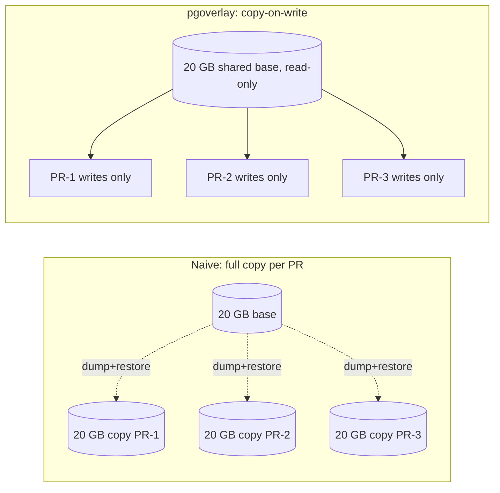
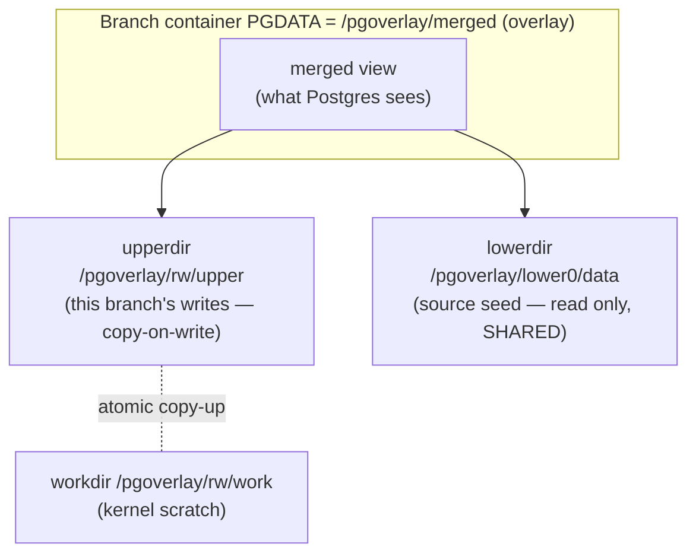
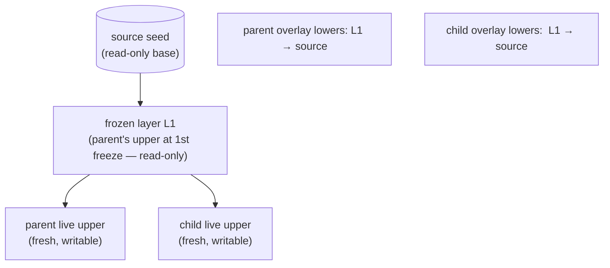

# Core concepts

Written for a backend or platform engineer comfortable with Postgres and Linux but new to
copy-on-write filesystems and database branching. It builds the ideas from first
principles — intuition first, mechanism second, code citations third — and every claim is
grounded in the source, with file paths cited inline.

---

## 1. The problem: per-PR databases are expensive

Imagine your CI wants a real, writable Postgres database for **every pull request** so tests
can run migrations, insert rows, and tear it all down afterward. The obvious approach is:

1. `pg_dump` the production-shaped database.
2. `pg_restore` it into a fresh empty cluster for this PR.
3. Run the tests.
4. Throw the cluster away.

This works, but it scales badly on **two axes at once**:

- **Time.** A dump + restore is a full logical rebuild — every row re-inserted, every index
  re-built. For anything beyond a toy database this is minutes, not seconds. Multiply by the
  number of open PRs.
- **Storage.** Each PR gets a *complete independent copy* of the data. Ten PRs against a 20 GB
  database is 200 GB, even though the ten copies are 99.9% identical.

The waste is structural: the ten branches differ only in the handful of rows a test touches,
yet you paid to materialize ten full datasets.

**The pgoverlay insight:** the dataset is mostly shared and read-only. Don't copy it. *Share the
base, and copy only what each branch actually changes.* That single idea — copy-on-write — is
the conceptual heart of the project. A branch becomes near-instant to create and costs almost
nothing in storage until something is written to it.



---

## 2. Copy-on-write, explained simply

### Intuition: the transparency overlay

Think of the shared dataset as a printed page you are **not allowed to write on**. You want to
make edits without ruining it for everyone else. Two options:

- **Photocopy the whole page** (the naive approach) — slow, and you've doubled the paper.
- **Lay a clear transparency sheet over the page** and write your edits on the transparency.
  Anyone reading sees the original page *through* the transparency, except where you've written —
  there they see your mark instead.

That transparency is **copy-on-write (CoW)**:

- **Reads "fall through"** to the shared base. Nothing is copied just to read.
- **Writes go to a private layer** (the transparency). The base is never mutated.
- The first time you modify a particular thing, *that thing* (and only that thing) is copied up
  into your private layer; everything you never touch stays shared.

This is why a CoW branch is **instant to create** (you just hand out a fresh blank transparency)
and **near-zero storage at creation** (the transparency is empty until written). Storage grows
only in proportion to what the branch *changes*, not to the size of the dataset.

pgoverlay supports three CoW mechanisms behind one abstraction (`internal/cow/plan.go`,
`Backend`): **overlay** (the default), **zfs**, and **csi**. The rest of this document mostly
follows the overlay path, then contrasts the alternatives in §7.

---

## 3. OverlayFS specifically

### Intuition

OverlayFS is the Linux kernel's built-in "transparency sheet" for whole directory trees. It
takes a stack of directories and presents a single merged view. The terminology maps directly
onto the photocopy analogy:

| OverlayFS term | Role | Analogy |
| --- | --- | --- |
| `lowerdir` | shared, **read-only** base(s) | the printed page(s) |
| `upperdir` | this branch's **writable** layer | the transparency you write on |
| `workdir` | kernel scratch space for atomic copy-ups | the desk you work at |
| merged mount | the combined view processes actually use | what the reader sees |

When a process reads a file, the kernel checks the upper layer first, then falls through to the
lowers. When it writes, the kernel **copies the file up** into `upperdir` on first modification
and applies the write there. The lower layers are never touched.

### Turning a PGDATA into a CoW branch

A Postgres data directory (`PGDATA`) is just a directory tree. So:

- The **source's seeded data dir becomes the read-only `lowerdir`.**
- **Each branch gets its own empty `upperdir`** — its private writes.
- The branch's Postgres runs against the **merged** mount as its `PGDATA`.

The layout constants live in `internal/cow/plan.go`:

- `MergedPath = /pgoverlay/merged` — the overlay mount, used as `PGDATA` inside the branch
  container.
- `RWPath = /pgoverlay/rw` — where the branch's writable volume is mounted; `upper/` and `work/`
  live under it.
- Lower layers are mounted at `/pgoverlay/lower0`, `/pgoverlay/lower1`, … (`LowerMountTarget`).
  Lower 0 is always the source; higher indices are frozen layers (see §5).

`PlanBranch` (pure, no I/O) computes the overlay stack. The seeded cluster lives in a `data/`
subdirectory of the source volume — `pg_basebackup` insists on creating that dir itself with
`0700` (see §4) — so the actual overlay lower is `<mount>/data`:

```go
// internal/cow/plan.go — PlanBranch
lowers = append(lowers, LowerMountTarget(0)+"/data") // source is the LAST (deepest) lower
```

The lowers are ordered **newest-first, source last**, joined into `PGOVERLAY_LOWERS` (colon-
separated, `Plan.LowerEnv`). The host process never mounts anything — it only decides volume
names and mount targets. The mount itself happens **inside the branch container** via the
embedded entrypoint script (`internal/cow/entrypoint.sh`):

```sh
# internal/cow/entrypoint.sh
mount -t overlay overlay \
  -o "lowerdir=${PGOVERLAY_LOWERS},upperdir=/pgoverlay/rw/upper,workdir=/pgoverlay/rw/work" \
  "$PGDATA"
...
exec docker-entrypoint.sh postgres -c recovery_init_sync_method=syncfs
```

`startOverlayBranch` (`internal/engine/saga.go`) wires this up: it mounts the source volume
read-only at `lower0`, each frozen layer read-only at `lower1..N`, the writable volume at
`RWPath`, sets `PGDATA=/pgoverlay/merged` and `PGOVERLAY_LOWERS=...`, and runs the entrypoint.



### The catch: mounting overlay needs `CAP_SYS_ADMIN`

`mount -t overlay` is a privileged syscall. A normal unprivileged container cannot call it. So
any container that assembles its own overlay needs the `CAP_SYS_ADMIN` capability.

- **Docker:** the branch container is started with `CapAdd: ["SYS_ADMIN"]` and
  `apparmor=unconfined` (`internal/runtime/docker.go`, ~line 199, comment `// overlay mount
  inside container`).
- **Kubernetes (hostPath storage):** branch pods get `SYS_ADMIN` via
  `branchSecurityContext()`, and are **pinned to the storage node** because the lower layers are
  subdirectories of a data root on one node (`internal/runtime/kube.go` doc comment; `buildBranchPod`
  in `internal/runtime/kube_podspec.go` sets `NodeName: st.nodeName()` and the SYS_ADMIN context).

`CAP_SYS_ADMIN` is the famously broad "near-root" capability. Handing it to a database
container is a real security/operability trade-off, and node-pinning hurts scheduling
flexibility. **This trade-off is exactly why the CSI backend exists** (§7): it gets CoW from the
storage layer instead, so branch pods need no extra capabilities and can schedule anywhere
(`internal/runtime/kube_csi.go`: `branchSecurityContext()` returns `nil`, `nodeName()` returns `""`).

---

## 4. Seeding a source: building the shared base

A CoW branch needs a shared base to fall through to. **Seeding** is how that base is first
created — it's the one expensive, one-time operation, paid once per source (not per branch).
pgoverlay never touches data files from the host; all seeding runs inside helper containers
through the runtime driver (`internal/pgctl` package doc).

Two seeding modes (`internal/engine/engine.go`, `seedSource`, selected by `Source.SeedVia`):

### `pg_basebackup` — physical, byte-level (default)

`internal/pgctl/seed.go` runs `pg_basebackup -X stream --checkpoint=fast` into `/seed/data`:

- It is a **physical** copy — a byte-level clone of the running cluster's files, including WAL.
- It is fast and faithful, and the resulting data dir inherits production's `listen_addresses`
  and `pg_hba.conf` (so branches start it directly).
- **It requires a `REPLICATION` connection** on the source (superuser qualifies). Data lands in
  `<volume>/data` because `pg_basebackup` creates that dir itself at `0700`; the helper runs as
  the in-image `postgres` user (uid 999) so ownership matches branch containers.

Use this when you control the source Postgres and can grant replication.

### `--via dump` — logical, via `pg_dump | psql`

`internal/pgctl/seeddump.go` (`SeedDump`) takes a different route for managed Postgres
(Supabase, Neon, RDS, Cloud SQL) where physical replication is **not** allowed:

1. `initdb` a **fresh** cluster in `/seed/data`, using the same user/password the source was
   registered with (so branches accept the same credentials as basebackup mode). The password
   reaches `initdb` via a bash process-substitution pwfile, never argv.
2. Start a temporary socket-only server.
3. `pg_dump` from the remote, piped into `psql` with `ON_ERROR_STOP` and `set -o pipefail` (so a
   failing dump fails the whole pipe).
4. `pg_ctl stop -m fast` for a clean-shutdown cluster (branches start with no crash recovery).

Because a fresh `initdb` has neither `listen_addresses='*'` nor a permissive `pg_hba.conf`
(production-cloned ones do), the script appends both.

| | `pg_basebackup` (physical) | `--via dump` (logical) |
| --- | --- | --- |
| What it copies | exact bytes + WAL | logical schema + data, replayed into a fresh cluster |
| Privilege needed | `REPLICATION` on source | ordinary user; **no replication** |
| Works against managed PG | usually no | yes (Supabase/Neon/RDS/Cloud SQL) |
| Version constraint | matches source | helper image major version must be ≥ remote server |
| Speed/fidelity | faster, byte-faithful | slower, but provider-agnostic |

Both modes are entered from `AddSource` (`internal/engine/engine.go`), which creates the source
layer, seeds it, and marks the source ready. `RefreshSource` re-seeds into a **new generation**
volume so existing branches keep their old base and only new branches see fresh data.

---

## 5. Branch-from-branch and the frozen-layer DAG

This is the hardest part of the model. Everything above assumed a branch bases directly on the
source. But you often want to branch **off another branch** — e.g. branch `feature` adds a
migration, and you want `feature-test` to start from `feature`'s *current* state, not the
source's.

### The problem

A branch's `upperdir` is **writable** — Postgres is actively writing to it. But OverlayFS lower
layers must be **read-only and stable**: if the kernel let a lower layer change underneath a
running overlay, the merged view would be incoherent. So you cannot simply point the child's
overlay at the parent's live `upperdir`.

### The mechanism: freeze, then fork

When you branch off a ready branch, the parent's current writable layer is **frozen** — turned
into an immutable layer that can serve as a shared lower for the child — and the parent is given
a **fresh** empty upper so it can keep writing. This is the *freeze saga*
(`internal/engine/freeze.go`, `freezeAndProvision`; entry point `CreateBranchFrom`):

```
CHECKPOINT parent          # clean snapshot, minimal WAL replay for the frozen layer
→ stop parent              # its rw volume must not change while it becomes a layer
→ fresh parent rw volume   # the "swap" — newRW = BranchRWVolumeNameGen(parent, gen+1)
→ restart parent on  [frozen old-rw, …parent's old chain…, source]  (wait ready)
→ start child   on   [frozen old-rw, …parent's old chain…, source]  (wait ready)
→ CommitFreeze             # one transaction: layer row + parent swap + child base
→ child ready
```

The parent's old `upper` becomes the **newest frozen layer**, and *both* the restarted parent
and the new child stack on the same frozen chain (`internal/engine/freeze.go`):

```go
frozen := append([]string{parent.RWVolume}, layerVolumes(chain)...)
newRW := cow.BranchRWVolumeNameGen(parent.Name, len(chain)+2)
parentPlan := cow.PlanBranch(newRW, parent.SourceVolume, frozen)   // parent keeps writing on a fresh upper
childPlan  := cow.PlanBranch(child.RWVolume, child.SourceVolume, frozen)
```

The saga is **atomic and crash-safe**. Each step registers a compensation that unwinds in
reverse on failure (`undo` stack + `fail()`); if anything fails before commit, `restoreParent`
puts the parent back on its **original** rw volume and chain. The parent's data is never lost —
worst case the parent is marked failed but its original volume is untouched. All registry
effects (the new layer row, the parent's rw-volume swap, the child's base layer) commit together
in `CommitFreezeCtx` (`internal/registry/registry.go`), which requires the parent to be
mid-freeze (`resetting`) and does layer-insert + parent-swap + child-base in one transaction.

### The resulting layer chain (DAG)

Each freeze prepends one immutable layer. A branch's chain is resolved by walking
`base_layer_id → parent_layer_id` links (`LayerChain`, topmost/newest first; source volume is
implicitly the deepest lower):



Branch a third time off the child and you get a second frozen layer chained onto `L1`, forming a
**DAG of immutable layers** with live writable uppers hanging off the leaves. (Resetting a
branch returns it to its derived base chain, not to the raw source — `provision` in
`internal/engine/saga.go` rebuilds the plan from `LayerChain`.)

### Refcounting: a layer can't be deleted while a child needs it

Frozen layers are shared, so deleting one out from under a live descendant would corrupt it.
pgoverlay **derives** refcounts rather than storing them. `CountBranchesReferencingLayer`
(`internal/registry/registry.go`) runs a recursive CTE counting the distinct **live** branches
whose chain contains a layer (directly or via descendants). On `DestroyBranch`
(`internal/engine/saga.go`), `gcLayers` walks the chain topmost-first and removes only
zero-refcount layers, stopping at the first still-referenced one (because any branch referencing
a layer also references all its ancestors). This is why an **overlay** parent can be destroyed
while children live — the frozen layer volumes keep the children's data alive independently of
the parent row.

---

## 6. Masking: scrubbing sensitive data at branch creation

When the shared base is production-shaped, branches would otherwise expose real customer data to
CI and developers. **Masking** optionally runs SQL to scrub/anonymize that data — and it runs
**when each branch is created**, inside the branch's own private layer, so the shared base is
never mutated and the branch never serves unmasked data.

Mechanism (`internal/engine/saga.go`, `applyMasking`, part of `awaitAndMark`):

- Mask scripts are registered per source (`GetMaskScripts`, registry order).
- Each runs via in-container `psql` over the local socket — peer/local auth, so the engine
  **never needs a password** (`psqlCmd`).
- Each runs with `ON_ERROR_STOP=1`; the **first failing script fails the branch** (masking is a
  hard gate, not best-effort).
- It runs on create, on reset (reset re-clones, so it must re-mask), and on freeze children
  (`freezeAndProvision` calls `applyMasking` too). Because a freeze child's lineage is already
  masked (the parent was), scripts see their own prior output — hence the documented contract
  that **mask scripts must be idempotent**.

Masking pairs naturally with **credential rotation** (`rotateBranchCredentials`): a fresh branch
gets its own random password applied via the same in-socket `psql` path.

---

## 7. Alternative backends: ZFS and CSI

OverlayFS is the default and needs nothing but the Linux kernel — but it pays for it with
`CAP_SYS_ADMIN` and (in Kubernetes hostPath mode) node-pinning. Two alternative backends get CoW
from the **storage layer** instead, so the branch container runs Postgres *directly* on a
writable clone with **no overlay assembly** (`internal/cow/entrypoint_direct.sh`; the planner
returns `EntrypointScriptDirect` for both, `internal/cow/plan.go`).

### ZFS — dataset snapshots and clones

ZFS has native block-level CoW. A branch becomes `zfs snapshot` of the source dataset followed by
`zfs clone` of that snapshot — both instant, both block-level CoW
(`internal/engine/saga.go`, `provisionZFS`; argv built in `internal/cow/plan.go`,
`ZFSSnapshot`/`ZFSClone`). Branch-from-branch needs **no freeze** — you just snapshot the
parent's clone and clone *that* (`CreateBranchFrom`: "block-level CoW … No freeze, no stop, no
layer rows"). The cost: a ZFS **parent cannot be destroyed while children live** (the children's
clones depend on snapshots on the parent's dataset — guarded in `DestroyBranch`), the opposite of
the overlay parent rule. ZFS commands run in privileged helper containers with `/dev/zfs` mapped
in (`internal/engine/zfs.go`). Fits when you already run ZFS on the host and want the cleanest CoW.

### CSI — Kubernetes volume-snapshot/clone

In Kubernetes, the CSI backend makes each branch's writable layer a **PVC clone** of its base
PVC — either a CSI `dataSource` clone or a `VolumeSnapshot` restore (`internal/runtime/kube_csi.go`,
`cloneVolume`). The branch pod runs the direct entrypoint straight on the clone. The headline
benefit: **no overlay, no `SYS_ADMIN`, no node pinning, no layer rows** — pods schedule anywhere
with no extra capabilities (`internal/engine/csi.go` top comment; `csiStorage.branchSecurityContext()`
returns `nil`). The subtlety: cloning a *live* parent PVC is not crash-safe (the CSI spec leaves
clones of in-use volumes driver-defined), so branch-from-branch briefly **quiesces** the parent —
`CHECKPOINT → stop → clone → restart parent → start child` (`provisionCSI`, mirroring the freeze
saga's safety but without the layer machinery). Fits when you run on Kubernetes with a CSI driver
that supports clones/snapshots and want to avoid privileged pods.

### Backend comparison

| | Overlay (default) | ZFS | CSI (Kubernetes) |
| --- | --- | --- | --- |
| CoW source | OverlayFS in-container | ZFS snapshot+clone | PVC clone / VolumeSnapshot |
| Branch container | assembles overlay | runs directly on clone | runs directly on clone |
| Privilege | `CAP_SYS_ADMIN` | privileged zfs helpers | **none** |
| Branch-from-branch | **freeze saga** (frozen layers) | snapshot+clone of clone | quiesce parent + clone |
| Layer rows / refcount | yes (frozen layers) | no | no |
| Parent destroy w/ live children | allowed (layers keep children alive) | refused | allowed (independent PVCs) |
| Best when | plain Docker/Linux host | host already runs ZFS | K8s with snapshot-capable CSI |

---

## Mental model to carry forward

- A **source** is the one expensive thing you build once (§4): a shared, read-only base.
- A **branch** is a cheap private writable layer over that base (§2–§3): instant, near-zero
  storage until written.
- **Branch-from-branch** turns a live writable layer into a frozen shared layer so a child can
  base on it, building a refcounted **DAG of immutable layers** (§5).
- **Masking** (§6) scrubs each branch's private copy at creation without touching the base.
- The **backend** (§7) only changes *where* CoW comes from — the kernel (overlay), the
  filesystem (zfs), or the storage layer (csi). The branching model is the same.
