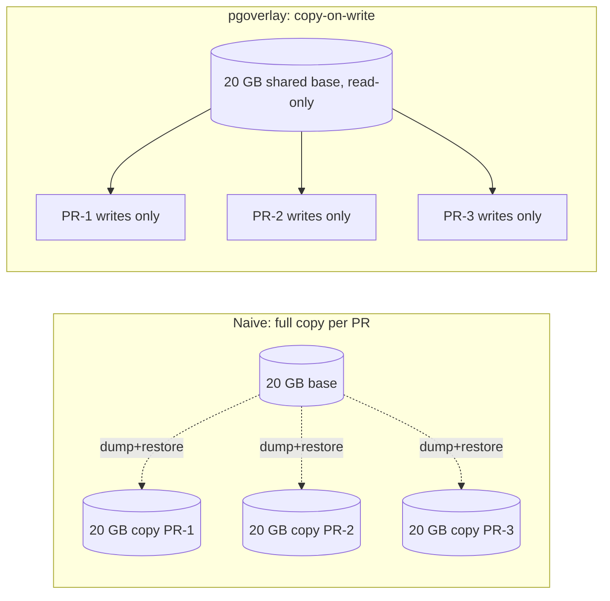
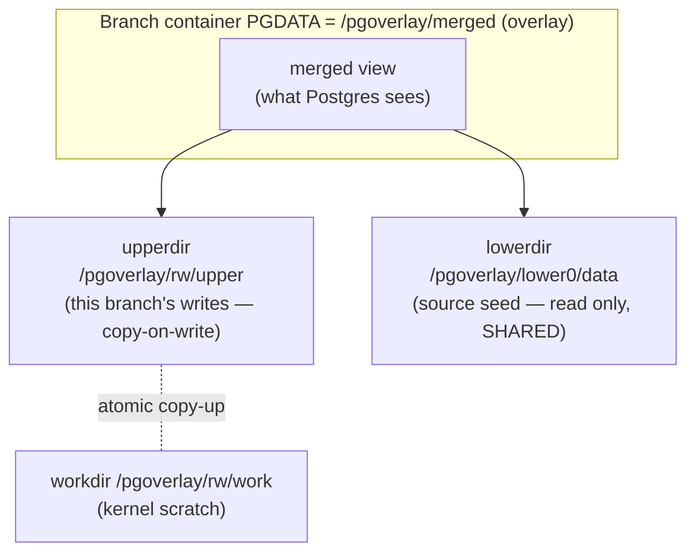
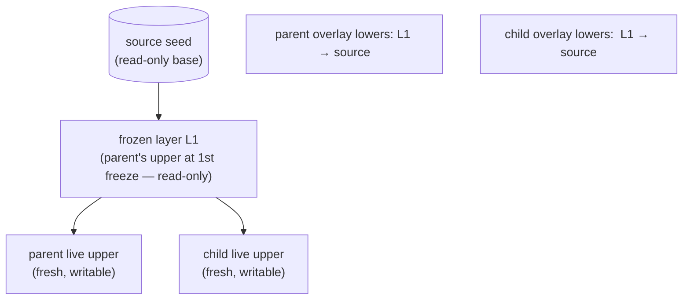

# Core concepts

Written for a backend or platform engineer comfortable with Postgres and Linux but new to
copy-on-write filesystems and database branching. It builds the ideas from first
principles — intuition first, mechanism second, code citations third — and every claim is
grounded in the source, with file paths cited inline.

---

## 1. The problem: per-PR databases are expensive

Imagine your CI wants a real, writable Postgres database for **every pull request** so tests
can run migrations, insert rows, and tear it all down afterward. The obvious approach is:

1. `pg_dump` the production-shaped database.
2. `pg_restore` it into a fresh empty cluster for this PR.
3. Run the tests.
4. Throw the cluster away.

This works, but it scales badly on **two axes at once**:

- **Time.** A dump + restore is a full logical rebuild — every row re-inserted, every index
  re-built. For anything beyond a toy database this is minutes, not seconds. Multiply by the
  number of open PRs.
- **Storage.** Each PR gets a *complete independent copy* of the data. Ten PRs against a 20 GB
  database is 200 GB, even though the ten copies are 99.9% identical.

The waste is structural: the ten branches differ only in the handful of rows a test touches,
yet you paid to materialize ten full datasets.

**The pgoverlay insight:** the dataset is mostly shared and read-only. Don't copy it. *Share the
base, and copy only what each branch needs its own copy of.* That single idea — copy-on-write —
is the conceptual heart of the project. A branch becomes near-instant to create and costs almost
nothing in storage when it starts. (How much it costs later depends on the backend and the
filesystem: §3 explains what "needs its own copy of" means on the default overlay backend, and
§8 how a filesystem that can clone shrinks it from files to blocks.)


```mermaid
flowchart LR
  subgraph naive["Naive: full copy per PR"]
    base1[(20 GB base)]
    c1[(20 GB copy PR-1)]
    c2[(20 GB copy PR-2)]
    c3[(20 GB copy PR-3)]
    base1 -.dump+restore.-> c1
    base1 -.dump+restore.-> c2
    base1 -.dump+restore.-> c3
  end
  subgraph cow["pgoverlay: copy-on-write"]
    base2[(20 GB shared base, read-only)]
    d1[PR-1 writes only]
    d2[PR-2 writes only]
    d3[PR-3 writes only]
    base2 --> d1
    base2 --> d2
    base2 --> d3
  end
```

---

## 2. Copy-on-write, explained simply

### Intuition: the transparency overlay

Think of the shared dataset as a printed page you are **not allowed to write on**. You want to
make edits without ruining it for everyone else. Two options:

- **Photocopy the whole page** (the naive approach) — slow, and you've doubled the paper.
- **Lay a clear transparency sheet over the page** and write your edits on the transparency.
  Anyone reading sees the original page *through* the transparency, except where you've written —
  there they see your mark instead.

That transparency is **copy-on-write (CoW)**:

- **Reads "fall through"** to the shared base. Nothing is copied just to read.
- **Writes go to a private layer** (the transparency). The base is never mutated.
- The first time you modify a particular thing, *that thing* (and only that thing) is copied up
  into your private layer; everything you never touch stays shared.

This is why a CoW branch is **instant to create** (you just hand out a fresh blank transparency)
and **near-zero storage at creation** (the transparency is empty until written). In the ideal
case storage grows only in proportion to what the branch *changes*. Real mechanisms differ in
what "a particular thing" is: ZFS and most CSI drivers copy **blocks**, OverlayFS copies **whole
files**, and decides to copy when a file is *opened for writing*, not when it is written.
pgoverlay moves that decision to the first real write (§3), and on a filesystem that can clone
extents the whole-file copy becomes a clone that shares every block until one is rewritten (§8).

pgoverlay supports three CoW mechanisms behind one abstraction (`internal/cow/plan.go`,
`Backend`): **overlay** (the default), **zfs**, and **csi**. The rest of this document mostly
follows the overlay path, then contrasts the alternatives in §7.

---

## 3. OverlayFS specifically

### Intuition

OverlayFS is the Linux kernel's built-in "transparency sheet" for whole directory trees. It
takes a stack of directories and presents a single merged view. The terminology maps directly
onto the photocopy analogy:

| OverlayFS term | Role | Analogy |
| --- | --- | --- |
| `lowerdir` | shared, **read-only** base(s) | the printed page(s) |
| `upperdir` | this branch's **writable** layer | the transparency you write on |
| `workdir` | kernel scratch space for atomic copy-ups | the desk you work at |
| merged mount | the combined view processes actually use | what the reader sees |

When a process reads a file, the kernel checks the upper layer first, then falls through to the
lowers. When a process **opens** a lower-layer file for writing (`O_RDWR` or `O_WRONLY`), the
kernel first **copies the whole file up** into `upperdir`, and every later read and write goes
to that copy. The lower layers are never touched.

Two details of that rule decide what a branch costs:

- **The unit is the file.** A Postgres table or index is stored in segment files of up to
  1 GiB, so the first write to one row copies the whole segment (unless the filesystem can
  clone, §8).
- **The trigger is the open, not the write.** PostgreSQL's storage manager opens every relation
  segment `O_RDWR`, even for a plain `SELECT` (`src/backend/storage/smgr/md.c`). Left alone, the
  first query of any kind that touches a table copies its files into the branch: before v1.0.0
  a fresh branch was about 33 MiB, and after one `SELECT count(*)` on a 489 MB table it was
  523 MiB ([measurement](benchmarks.md#reads-copy-up-too)), and the first query on a large table
  waited for the copy.

The same rule is behind the project's founding bug: before WAL replay, Postgres's default
`recovery_init_sync_method=fsync` opens every data file read-write to fsync it, which copied the
whole database into every new branch.
The branch entrypoint's `recovery_init_sync_method=syncfs` avoids that pass
([benchmarks](benchmarks.md#the-fix)). The read path needs more than a flag, because read-write
opens are how stock Postgres reads; the lazyrw shim below handles it.

### Copy on first write: the lazyrw shim

OverlayFS decides from the open flags, so the fix is to change the flags Postgres opens with,
without changing Postgres. The branch's Postgres runs with a small `LD_PRELOAD` library, the
**lazyrw shim** (`internal/cow/lazyrw/lazyrw.c`), which sits between Postgres and libc:

- **Open read-only.** A read-write open (`O_RDWR` or `O_WRONLY`, without `O_CREAT` or `O_TRUNC`)
  of a relation or transaction-status file under `PGDATA` (`base/`, `global/`, `pg_tblspc/`,
  `pg_xact/`, `pg_multixact/`, `pg_subtrans/` and the other SLRU directories) is performed
  `O_RDONLY` instead, and the shim remembers the file descriptor, the path, the flags Postgres
  asked for and the file's identity. OverlayFS sees a read-only open and copies nothing. The
  WAL is never touched: it is written anyway.
- **Upgrade on the first write.** The first write-class call on such a descriptor (`write`,
  `pwrite*`, `pwritev*`, `ftruncate`, `fallocate`, `copy_file_range`, a shared writable
  `mmap`, ...) reopens the path with the original flags, which is where OverlayFS copies the
  file up, and moves the new open file onto the same descriptor number (keeping the offset and
  close-on-exec flag) before the call proceeds. A backend that only reads never upgrades.
- **Other backends follow.** Postgres is one process per connection, so other backends may
  still hold read-only descriptors for the lower file. Since Linux 4.19 OverlayFS re-targets
  them to the copied-up file (stacked file operations), so they read the new data. Before
  4.19 they would keep reading the stale lower file, so every branch **self-tests** this at
  start (below) and does not use the shim where it fails.
- **Truncation is free.** `TRUNCATE`, `DROP`, `VACUUM FULL`, `CLUSTER` and table rewrites
  truncate files to zero, and `truncate()` of a lower file copies all of it first. The shim
  turns `truncate(path, 0)` into an `O_TRUNC` open and `ftruncate(fd, 0)` of a read-only
  descriptor into an `O_TRUNC` upgrade; OverlayFS copies zero bytes for an `O_TRUNC` open.

It is hardened for being the default: it is active only inside the `postgres` server binary
with `PGDATA` set (the entrypoint shell, `gosu`, `archive_command` and `COPY ... PROGRAM` get
pure pass-through wrappers); a descriptor is upgraded only if it is still the file it was (a
descriptor closed behind the shim's back and reused for a socket is never swapped); a failed
upgrade fails the write with an error rather than writing through a read-only descriptor; and
every libc pointer has a raw-syscall fallback for calls made before the shim has initialised.
CI checks that every write-class libc function the `postgres` binary of each supported image
imports is either interposed or reviewed (`make pg-import-audit`).

**How a branch turns it on** (`internal/cow/entrypoint.sh`). branchd installs the shim builds
(glibc and musl, x86_64 and aarch64, committed under `internal/cow/lazyrw/dist` and embedded in
the binary) into `/pgoverlay/rw/lazyrw/` of each rw volume, next to the entrypoint and outside
`upper/`, so they are never overlay content. After mounting the overlay the entrypoint:

1. runs the **self-test** on a scratch overlay: a file opened read-only before another open
   copies it up and rewrites it must read the new data;
2. picks the build for the image's libc (musl when `/lib/ld-musl-*` exists) and `uname -m`;
3. **probes** it: `postgres -V`, run as the postgres user with the build preloaded, must print
   the shim's own "active" line (musl ignores a preload it cannot load without a word, so an
   empty stderr would prove nothing);
4. exports `LD_PRELOAD`, and on PG 18 and later appends `-c io_method=worker`: the shim sees
   libc calls, not `io_uring` submissions;
5. records the outcome in `/pgoverlay/rw/cow-mode`: `lazyrw`, `eager` (the shim was wanted but a
   check failed; Postgres copies on open, as before) or `off` (`--lazyrw=off`), with a detail
   line.

branchd reads that file after every readiness wait (`internal/engine/cowmode.go`), logs it, warns
on `eager`, and counts ready branches per mode in `pgoverlay_branch_cow_mode`. Nothing else in
the branch changes: the same stock image, the same privileges, and create time still does not
depend on the database size.

What a branch still writes after reads: nothing in table or index files. The integration run
measured a few hundred KiB of catalog and transaction-status pages on the first read pass
(`pg_statistic` hint bits, one page each of `pg_xact`, `pg_subtrans` and `pg_multixact`) and,
once per branch, the current 16 MiB WAL segment when the branch first writes WAL. Both are
constant, not proportional to the data read ([benchmarks](benchmarks.md#true-copy-on-write-v100)).

### Turning a PGDATA into a CoW branch

A Postgres data directory (`PGDATA`) is just a directory tree. So:

- The **source's seeded data dir becomes the read-only `lowerdir`.**
- **Each branch gets its own empty `upperdir`** — its private writes.
- The branch's Postgres runs against the **merged** mount as its `PGDATA`.

The layout constants live in `internal/cow/plan.go`:

- `MergedPath = /pgoverlay/merged` — the overlay mount, used as `PGDATA` inside the branch
  container.
- `RWPath = /pgoverlay/rw` — where the branch's writable volume is mounted; `upper/` and `work/`
  live under it.
- Lower layers are mounted at `/pgoverlay/lower0`, `/pgoverlay/lower1`, … (`LowerMountTarget`).
  Lower 0 is always the source; higher indices are frozen layers (see §5).

`PlanBranch` (pure, no I/O) computes the overlay stack. The seeded cluster lives in a `data/`
subdirectory of the source volume — `pg_basebackup` insists on creating that dir itself with
`0700` (see §4) — so the actual overlay lower is `<mount>/data`:

```go
// internal/cow/plan.go — PlanBranch
lowers = append(lowers, LowerMountTarget(0)+"/data") // source is the LAST (deepest) lower
```

The lowers are ordered **newest-first, source last**, joined into `PGOVERLAY_LOWERS` (colon-
separated, `Plan.LowerEnv`). The host process never mounts anything — it only decides volume
names and mount targets. The mount itself happens **inside the branch container** via the
embedded entrypoint script (`internal/cow/entrypoint.sh`):

```sh
# internal/cow/entrypoint.sh
mount -t overlay overlay \
  -o "lowerdir=${PGOVERLAY_LOWERS},upperdir=/pgoverlay/rw/upper,workdir=/pgoverlay/rw/work" \
  "$PGDATA"
...
exec docker-entrypoint.sh postgres -c recovery_init_sync_method=syncfs
```

`startOverlayBranch` (`internal/engine/saga.go`) wires this up: it mounts the source volume
read-only at `lower0`, each frozen layer read-only at `lower1..N`, the writable volume at
`RWPath`, sets `PGDATA=/pgoverlay/merged` and `PGOVERLAY_LOWERS=...`, and runs the entrypoint.


```mermaid
flowchart TB
  subgraph branch["Branch container PGDATA = /pgoverlay/merged (overlay)"]
    merged["merged view\n(what Postgres sees)"]
  end
  upper["upperdir  /pgoverlay/rw/upper\n(this branch's writes — copy-on-write)"]
  work["workdir  /pgoverlay/rw/work\n(kernel scratch)"]
  lower0["lowerdir  /pgoverlay/lower0/data\n(source seed — read only, SHARED)"]
  merged --> upper
  merged --> lower0
  upper -. atomic copy-up .- work
```

### The catch: mounting overlay needs `CAP_SYS_ADMIN`

`mount -t overlay` is a privileged syscall. A normal unprivileged container cannot call it. So
any container that assembles its own overlay needs the `CAP_SYS_ADMIN` capability.

- **Docker:** the branch container is started with `CapAdd: ["SYS_ADMIN"]` and
  `apparmor=unconfined` (`internal/runtime/docker.go`, `StartBranch`, comment `// overlay mount
  inside container`). The Docker driver does this for every branch, whatever the backend.
- **Kubernetes (hostPath storage):** branch pods get `SYS_ADMIN` plus unconfined seccomp and
  AppArmor profiles via `hostPathStorage.branchSecurityContext()`, and are **pinned to the storage
  node** because the lower layers are subdirectories of a data root on one node
  (`internal/runtime/kube.go` doc comment; `buildBranchPod` in `internal/runtime/kube_podspec.go`
  sets `NodeName: st.nodeName()` and that security context).

`CAP_SYS_ADMIN` is the famously broad "near-root" capability. Handing it to a database
container is a real security/operability trade-off (see [Security](security.md)), and
node-pinning hurts scheduling flexibility. **This trade-off is exactly why the CSI backend
exists** (§7): it gets CoW from the storage layer instead, so branch pods need no extra
capabilities and can schedule anywhere (`internal/runtime/kube_csi.go`:
`csiStorage.branchSecurityContext()` adds no capabilities and sets `RuntimeDefault` seccomp and
`allowPrivilegeEscalation: false`; `nodeName()` returns `""`).

---

## 4. Seeding a source: building the shared base

A CoW branch needs a shared base to fall through to. **Seeding** is how that base is first
created — it's the one expensive, one-time operation, paid once per source (not per branch).
pgoverlay never touches data files from the host; all seeding runs inside helper containers
through the runtime driver (`internal/pgctl` package doc).

Two seeding modes (`internal/engine/engine.go`, `seedSource`, selected by `Source.SeedVia`):

### `pg_basebackup` — physical, byte-level (default)

`internal/pgctl/seed.go` runs `pg_basebackup -X stream --checkpoint=fast` into `/seed/data`:

- It is a **physical** copy — a byte-level clone of the running cluster's files, including WAL.
- It is fast and faithful. The data dir carries production's `pg_hba.conf` and configuration,
  but branches override the settings that would tie them to the source host: the entrypoints
  pass `port`, `listen_addresses`, `unix_socket_directories`, `hba_file`/`ident_file` (the copies
  in the data dir), `logging_collector=off`, `archive_mode=off` and an empty
  `synchronous_standby_names`, and `ssl=off` when the data dir has no `server.crt`. Distro
  packages that keep configuration outside the data dir get minimal generated files.
  `shared_preload_libraries` and `include` directives are kept, so the branch image must carry
  those libraries (`--image`).
- **A standby works as the source**, and is the recommended one. After the copy a fixup helper
  deletes `standby.signal`/`recovery.signal` and strips `primary_conninfo`, `restore_command` and
  the other recovery settings, and branches start with them blanked, so a branch never becomes a
  replica of production. The helper also checks the copy's `PG_VERSION` against the image and
  fails the seed on a major-version mismatch.
- **It requires a `REPLICATION` connection** on the source (superuser qualifies). Data lands in
  `<volume>/data` because `pg_basebackup` creates that dir itself at `0700`; the helper runs as
  the in-image `postgres` user (uid 999) so ownership matches branch containers. The connection
  uses `PGOVERLAY_SEED_SSLMODE` (default `prefer`) and times out after 10 s.

Use this when you control the source Postgres and can grant replication.

### `--via dump` — logical, via `pg_dump | psql`

`internal/pgctl/seeddump.go` (`SeedDump`) takes a different route for managed Postgres
(Supabase, Neon, RDS, Cloud SQL) where physical replication is **not** allowed:

1. `initdb` a **fresh** cluster in `/seed/data`, using the same user/password the source was
   registered with (so branches accept the same credentials as basebackup mode). The password
   reaches `initdb` via a bash process-substitution pwfile, never argv.
2. Start a temporary socket-only server.
3. Recreate the source's other roles as `NOLOGIN` shells (so ownership and grants restore) and,
   for a schema-scoped dump, create the source's extensions first; an extension the image lacks
   is reported and skipped.
4. `pg_dump` from the remote, piped into `psql` with `ON_ERROR_STOP` and `set -o pipefail` (so a
   failing dump fails the whole pipe). `psql` runs terse, so an error does not echo row data.
5. `pg_ctl stop -m fast` for a clean-shutdown cluster (branches start with no crash recovery).

Because a fresh `initdb` has neither `listen_addresses='*'` nor a permissive `pg_hba.conf`,
the script appends both. Row-level security policies that call functions in a schema you did
not dump (Supabase's `auth.uid()`) need that schema in `--dump-schema` too.

| | `pg_basebackup` (physical) | `--via dump` (logical) |
| --- | --- | --- |
| What it copies | exact bytes + WAL | logical schema + data, replayed into a fresh cluster |
| Privilege needed | `REPLICATION` on source | ordinary user; **no replication** |
| Works against managed PG | usually no | yes (Supabase/Neon/RDS/Cloud SQL) |
| Version constraint | `--pg-version` must equal the source major (checked) | image major must be ≥ remote server |
| Speed/fidelity | faster, byte-faithful | slower, but provider-agnostic |

### Seed settle: doing the first reads' writes once

The lazyrw shim makes a read copy nothing only if the read really writes nothing, and on a fresh
`pg_basebackup` copy it does write:

- an online backup ends with a `backup_label`, so every branch would start with crash recovery,
  replaying the WAL streamed during the backup and writing the pages it touches;
- pages carry the source's unset **hint bits**: the first read of a row whose inserting
  transaction has committed records that fact on the page, which dirties it;
- reads also prune dead row versions (HOT pruning), and tables with old unfrozen transaction ids
  get an anti-wraparound autovacuum in every branch.

Each of those is a write, so on the overlay backend it copies the touched segment into every
branch. **Seed settle** (`internal/pgctl/settle.go`, `Settle`, called from `seedSource` for every
backend) does that work once, in the seed, right after `pg_basebackup`: a helper on the branch
image, running as the postgres user, starts Postgres on the seed with a private socket and no
listener (and with preload libraries, archiving, TLS, the logging collector and other settings
that cannot start in a throwaway container overridden), which completes the backup's recovery;
runs `vacuumdb --all --freeze --analyze`; checkpoints; and stops it with a fast, clean shutdown.
The source is never touched. Modes (`--seed-settle`, `PGOVERLAY_SEED_SETTLE`, Helm `seedSettle`):

- `freeze` (default): recover, `VACUUM (FREEZE, ANALYZE)` every database, clean shutdown;
- `recover`: recover and shut down cleanly, no VACUUM; branches skip WAL replay but reads may
  still set hint bits;
- `off`: the seed as `pg_basebackup` wrote it.

A dump seed already ends with a clean shutdown; with `freeze` its helper runs the same VACUUM
before stopping. A VACUUM that fails is logged and the seed kept (it is still cleanly shut
down); a seed that cannot start or stop cleanly fails, because every branch would fail the same
way. Settling adds roughly one read of the database, plus a write of its unfrozen pages, to the
seed time. It runs inside the seed's heartbeat, so a long settle is never mistaken for an
abandoned seed. The zfs and csi backends gain from it too: their branches start without crash
recovery.

Both modes are entered from `AddSource` (`internal/engine/engine.go`), which creates the source
layer, seeds it, settles it, and marks the source ready. `RefreshSource` re-seeds into a **new
generation** volume so existing branches keep their old base and only new branches see fresh
data.

---

## 5. Branch-from-branch and the frozen-layer DAG

This is the hardest part of the model. Everything above assumed a branch bases directly on the
source. But you often want to branch **off another branch** — e.g. branch `feature` adds a
migration, and you want `feature-test` to start from `feature`'s *current* state, not the
source's.

### The problem

A branch's `upperdir` is **writable** — Postgres is actively writing to it. But OverlayFS lower
layers must be **read-only and stable**: if the kernel let a lower layer change underneath a
running overlay, the merged view would be incoherent. So you cannot simply point the child's
overlay at the parent's live `upperdir`.

### The mechanism: freeze, then fork

When you branch off a ready branch, the parent's current writable layer is **frozen** — turned
into an immutable layer that can serve as a shared lower for the child — and the parent is given
a **fresh** empty upper so it can keep writing. This is the *freeze saga*
(`internal/engine/freeze.go`, `freezeAndProvision`; entry point `CreateBranchFrom`):

```
CHECKPOINT parent          # clean snapshot, minimal WAL replay for the frozen layer
→ stop parent              # its rw volume must not change while it becomes a layer
→ fresh parent rw volume   # the "swap": a never-used volume name, claimed on the parent row first
→ restart parent on  [frozen old-rw, …parent's old chain…, source]  (wait ready)
→ start child   on   [frozen old-rw, …parent's old chain…, source]  (wait ready)
→ CommitFreeze             # one transaction: layer row + parent swap + child base
→ child ready
```

The parent's old `upper` becomes the **newest frozen layer**, and *both* the restarted parent
and the new child stack on the same frozen chain (`internal/engine/freeze.go`):

```go
frozen := append([]string{parent.RWVolume}, layerVolumes(chain)...)
// the lowest generation of the parent's volume name no registry row has ever used
newRW, err := e.freshBranchLayer(parent.Name, len(chain)+2)
parentPlan := cow.PlanBranch(newRW, parent.SourceVolume, frozen)   // parent keeps writing on a fresh upper
childPlan  := cow.PlanBranch(child.RWVolume, child.SourceVolume, frozen)
```

The saga is **atomic and crash-safe**. Each step registers a compensation that unwinds in
reverse on failure (`undo` stack + `fail()`); if anything fails before commit, `restoreParent`
puts the parent back on its **original** rw volume and chain. The parent's data is never lost:
worst case (branchd dies mid-freeze) the parent ends up `failed` with its original volume
untouched, and `pgb branch recover <parent>` restarts it on that data. While the saga runs it
heartbeats both rows, so reconcile never mistakes a slow freeze for an abandoned one, and the
parent's new volume is claimed on its row before it is created, so volume GC cannot take it. All
registry effects (the new layer row, the parent's rw-volume swap, the child's base layer) commit
together in `CommitFreezeCtx` (`internal/registry/registry.go`), which requires the parent to be
mid-freeze (`resetting`) and does layer-insert + parent-swap + child-base in one transaction.

### The resulting layer chain (DAG)

Each freeze prepends one immutable layer. A branch's chain is resolved by walking
`base_layer_id → parent_layer_id` links (`LayerChain`, topmost/newest first; source volume is
implicitly the deepest lower):


```mermaid
flowchart TB
  src[("source seed\n(read-only base)")]
  L1["frozen layer L1\n(parent's upper at 1st freeze — read-only)"]
  parentUpper["parent live upper\n(fresh, writable)"]
  childUpper["child live upper\n(fresh, writable)"]

  src --> L1
  L1 --> parentUpper
  L1 --> childUpper

  parentNote["parent overlay lowers: L1 → source"]
  childNote["child overlay lowers:  L1 → source"]
```

Branch a third time off the child and you get a second frozen layer chained onto `L1`, forming a
**DAG of immutable layers** with live writable uppers hanging off the leaves. (Resetting a
branch returns it to its derived base chain, not to the raw source — `provision` in
`internal/engine/saga.go` rebuilds the plan from `LayerChain`.)

Chains only grow: every fork of a parent adds a layer to the parent's chain, a reset keeps the
chain, and there is no compaction yet. A long-lived fixture branch forked over and over would
make every file lookup walk more and more layers, so branchd refuses a branch-from-branch once
the parent's chain reaches `--max-layer-depth` (default 100). The remedy is to recreate the
fixture from its source.

### Refcounting: a layer can't be deleted while a child needs it

Frozen layers are shared, so deleting one out from under a live descendant would corrupt it.
pgoverlay **derives** refcounts rather than storing them. `CountBranchesReferencingLayer`
(`internal/registry/registry.go`) runs a recursive CTE counting the distinct **live** branches
whose chain contains a layer (directly or via descendants). On `DestroyBranch`
(`internal/engine/saga.go`), `gcLayers` walks the chain topmost-first and removes only
zero-refcount layers, stopping at the first still-referenced one (because any branch referencing
a layer also references all its ancestors). This is why an **overlay** parent can be destroyed
while children live — the frozen layer volumes keep the children's data alive independently of
the parent row.

---

## 6. Masking: scrubbing sensitive data at branch creation

When the shared base is production-shaped, branches would otherwise expose real customer data to
CI and developers. **Masking** optionally runs SQL to scrub/anonymize that data — and it runs
**when each branch is created**, inside the branch's own private layer, so the shared base is
never mutated and the branch never serves unmasked data.

Mechanism (`internal/engine/saga.go`, `applyMasking`, part of `awaitAndMark`):

- Mask scripts are registered per source (`GetMaskScripts`, registry order).
- Each runs via in-container `psql` over the local socket as the source's connection user, so
  the engine **never needs a password** (`psqlCmd`). That relies on the source's `pg_hba.conf`
  `local` lines: on Docker the exec runs as the `postgres` OS user, so `trust`, or `peer` for the
  `postgres` role, works; on Kubernetes the exec runs as root, so `local` must be `trust`.
- Each runs with `ON_ERROR_STOP=1`; the **first failing script fails the branch** (masking is a
  hard gate, not best-effort; the API answers `422` with the script's error).
- It runs on create, on reset (reset re-clones, so it must re-mask), and on freeze children
  (`freezeAndProvision` calls `applyMasking` too). Because a freeze child's lineage is already
  masked (the parent was), scripts see their own prior output — hence the documented contract
  that **mask scripts must be idempotent**.

Masking pairs naturally with **credential rotation** (`rotateBranchCredentials`): a fresh branch
gets its own random password applied via the same in-socket `psql` path.

---

## 7. Alternative backends: ZFS and CSI

OverlayFS is the default and needs nothing but the Linux kernel — but it pays for it with
`CAP_SYS_ADMIN`, (in Kubernetes hostPath mode) node-pinning, and, on a filesystem that cannot
clone, whole-file copy-up on first write (§3, §8). Two alternative backends get CoW from the
**storage layer** instead, so the branch container runs Postgres *directly* on a writable clone
with **no overlay assembly** and no shim (`internal/cow/entrypoint_direct.sh`; the planner
returns `EntrypointScriptDirect` for both, `internal/cow/plan.go`). Both copy at block
granularity whatever the filesystem underneath, which matters for branches that write into many
large tables on a host whose volumes cannot clone.

### ZFS — dataset snapshots and clones

ZFS has native block-level CoW. A branch becomes `zfs snapshot` of the source dataset followed by
`zfs clone` of that snapshot — both instant, both block-level CoW
(`internal/engine/saga.go`, `provisionZFS`; argv built in `internal/cow/plan.go`,
`ZFSSnapshot`/`ZFSClone`). Branch-from-branch needs **no freeze** — you just snapshot the
parent's clone and clone *that* (`CreateBranchFrom`: "block-level CoW … No freeze, no stop, no
layer rows"). The costs: a ZFS **parent cannot be destroyed or reset while children live** (the
children's clones depend on snapshots on the parent's dataset — guarded up front in
`DestroyBranch` and `ResetBranch`), the opposite of the overlay parent rule; and a child's base
is the parent's *live* dataset, so resetting or diffing the child compares against the parent's
**current** state, not the fork point. ZFS commands run in privileged helper containers with
`/dev/zfs` mapped in (`internal/engine/zfs.go`), and the branch containers themselves still get
`CAP_SYS_ADMIN` and unconfined AppArmor from the runtime drivers, which do not distinguish
backends. Fits when you already run ZFS on the host and want the cleanest CoW.

### CSI — Kubernetes volume-snapshot/clone

In Kubernetes, the CSI backend makes each branch's writable layer a **PVC clone** of its base
PVC — either a CSI `dataSource` clone or a `VolumeSnapshot` restore (`internal/runtime/kube_csi.go`,
`cloneVolume`). The branch pod runs the direct entrypoint straight on the clone. The headline
benefit: **no overlay, no `SYS_ADMIN`, no node pinning, no layer rows** — pods schedule anywhere
with no extra capabilities (`internal/engine/csi.go` top comment; `csiStorage.branchSecurityContext()`
sets only `RuntimeDefault` seccomp and `allowPrivilegeEscalation: false`). The subtlety: cloning a
*live* parent PVC is not crash-safe (the CSI spec leaves clones of in-use volumes
driver-defined), so branch-from-branch briefly **quiesces** the parent —
`CHECKPOINT → stop → clone → restart parent → start child` (`provisionCSI`, mirroring the freeze
saga's safety but without the layer machinery). The same quiesce happens whenever a child is
reset or diffed, because its base is the parent's live PVC: the parent's connections drop, and
the comparison is against the parent's **current** state. A parent can be destroyed while
children live (every clone is an independent volume), but its children can then no longer be
reset or diffed; both are refused up front. Fits when you run on Kubernetes with a CSI driver
that supports clones/snapshots and want to avoid privileged pods.

### Backend comparison

| | Overlay (default) | ZFS | CSI (Kubernetes) |
| --- | --- | --- | --- |
| CoW source | OverlayFS in-container | ZFS snapshot+clone | PVC clone / VolumeSnapshot |
| Reads copy | nothing (lazyrw shim; every opened file in eager mode) | nothing | nothing, once cloned |
| Copy granularity | whole file on its first write; an extent clone, then blocks, on XFS/btrfs (§8) | block, on write | the CSI driver's (block on EBS/Ceph/zfs-localpv) |
| Branch container | assembles overlay | runs directly on clone | runs directly on clone |
| Privilege | `CAP_SYS_ADMIN` + unconfined AppArmor (and seccomp on K8s) | privileged zfs helpers, **and** `CAP_SYS_ADMIN` branch containers | **none** added; `RuntimeDefault` seccomp |
| Branch-from-branch | **freeze saga** (frozen layers; parent restarts) | snapshot+clone of clone (no parent interruption) | quiesce parent + clone (parent restarts) |
| Child reset/diff base | the fork point (frozen layers) | the parent's current state | the parent's current state (parent quiesced) |
| Layer rows / refcount | yes (frozen layers) | no | no |
| Parent destroy w/ live children | allowed (layers keep children alive) | refused | allowed (independent PVCs); children can no longer reset or diff |
| Best when | plain Docker/Linux host | host already runs ZFS | K8s with snapshot-capable CSI |

---

## 8. Clone or copy: what a copy-up costs

With the shim, a copy-up happens when a branch first writes a file. What that copy costs is
up to the filesystem that holds the volumes, not to pgoverlay:

- **Copy** (ext4, XFS without reflink, most others): the kernel copies the file's data. A
  1-row `UPDATE` in a 1 GiB segment copies 1 GiB into the branch, and the write waits for it.
  After that, writes to the file go to the branch's copy.
- **Clone** (XFS with `reflink=1`, btrfs): the kernel clones the file's extents. The copy-up
  takes milliseconds and no space; the branch's file shares every block with the seed until a
  block is rewritten, and then only that block is copied. That is block-level copy-on-write:
  XFS unshares up to 128 KiB around a rewritten page by default (its copy-on-write extent
  size), 16 KiB with the hint pgoverlay sets on a volume root it manages (`--xfs-cowextsize`),
  and btrfs about a page.

pgoverlay uses whichever the host gives it; nothing in the branch changes. **branchd probes**
at startup, in the background (`internal/cow/fsprobe.go`, `internal/engine/cowfs.go`): it
creates two temporary volumes where every volume goes, writes 64 MiB into one, mounts an overlay
across them the way a branch does (in a helper with a branch container's privileges), opens the
file read-write, and measures whether free space dropped and whether the copied-up file shares
its extents. The result is logged (`copy-up probe: mode=clone fs=xfs ...`) and exported as
`pgoverlay_cow_copyup_mode`.

Where the volumes live decides the answer:

- **Docker**, by default: Docker's volume store (`/var/lib/docker/volumes`), on whatever
  filesystem that is. Hosts whose root filesystem is XFS with reflink (current RHEL-family and
  Amazon Linux installs typically are) or btrfs get clones with no configuration.
- **Docker with `--volume-root DIR`**: every pgoverlay volume becomes a bind volume over a
  directory under `DIR`, so a host with an ext4 root and an XFS or btrfs data disk gets clones
  without moving Docker ([the volume root](reference.md#the-volume-root)).
- **Kubernetes hostPath**: the node's `--kube-data-root` (Helm `dataRoot`); put it on XFS or
  btrfs for clones.

The shim stays on either way: with it, a read opens no file read-write, so the page cache stays
shared between branches and a branch gets its own inode only for files it writes.

### Usage accounting

`pgb branch ls --usage` and `GET /v1/branches/{name}/usage` report the bytes a branch's
writable layer holds (`BranchUsage`, `internal/engine/engine.go`). In copy mode that is
`du -sb` of the rw volume, which is exact. In clone mode `du` would count a cloned 1 GiB segment
with one rewritten page as 1 GiB, so branchd runs `pgoverlay-du` instead
(`internal/cow/usage/pgoverlay-du.c`, a small static tool embedded in the binary): it walks the
volume with `FIEMAP` and counts only the extents the branch does not share, the bytes that
destroying it would free. It falls back to `du -sb` (which only ever over-counts) when the probe
has not run or failed, when there is no build for the host's architecture, or when the tool
fails. `pgb` in local mode does not probe, so it always reports `du -sb`.

---

## Mental model to carry forward

- A **source** is the one expensive thing you build once (§4): a shared, read-only base,
  settled so that reading it writes nothing.
- A **branch** is a cheap private writable layer over that base (§2–§3): instant, near-zero
  storage at creation, growing on the overlay backend by the files it writes (by the blocks it
  writes, where the filesystem can clone, §8).
- **Branch-from-branch** turns a live writable layer into a frozen shared layer so a child can
  base on it, building a refcounted **DAG of immutable layers** (§5).
- **Masking** (§6) scrubs each branch's private copy at creation without touching the base.
- The **backend** (§7) only changes *where* CoW comes from — the kernel (overlay), the
  filesystem (zfs), or the storage layer (csi). The branching model is the same.
