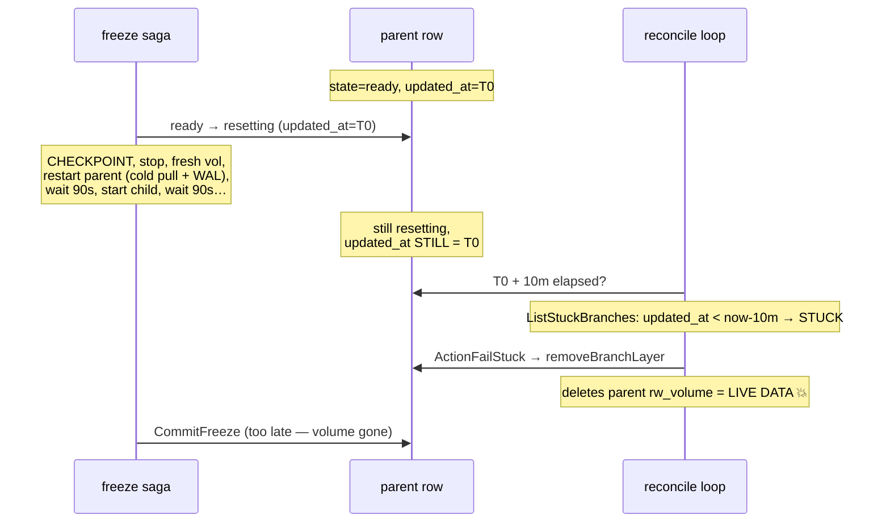
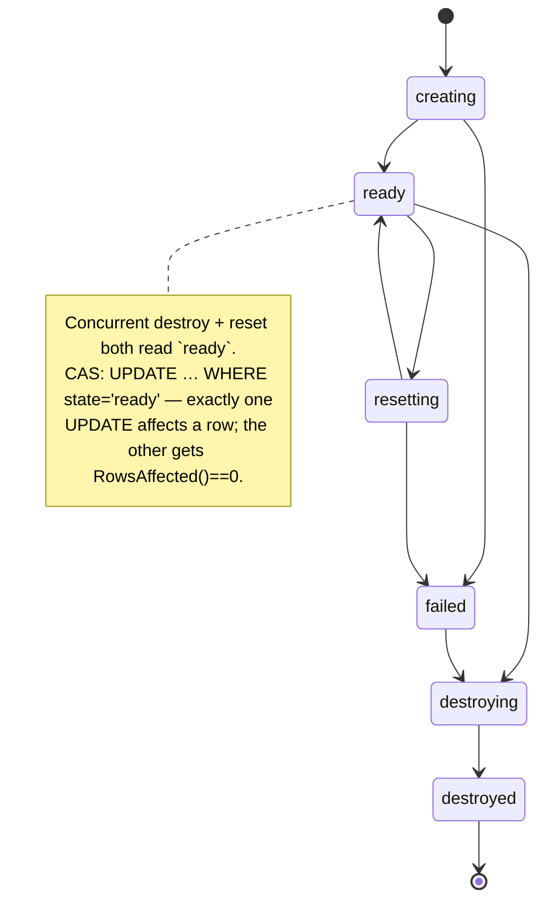
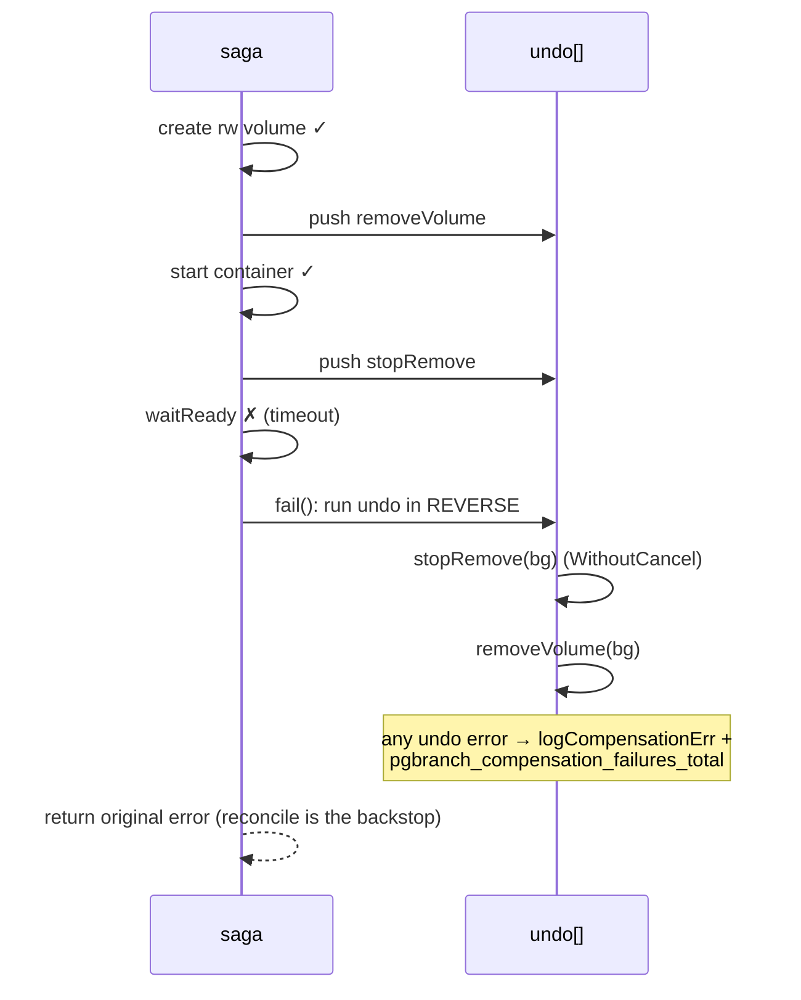

# Deep dives

[Architecture](architecture.md) and [design decisions](DESIGN-DECISIONS.md)
cover what pgbranch is and why it is shaped the way it is. This document covers
the six hardest problems in the codebase — the ones where the obvious
implementation was wrong, the bug was subtle enough to survive review, and the
fix generalizes past this project.

Each follows the same shape:

- **The problem** — what the code was trying to do.
- **Why it's subtle** — the trap; why the naive version looks correct.
- **The fix** — what actually lives in the code, cited as `file:func`.
- **The lesson** — the general principle worth carrying elsewhere.

Every claim was checked against the code. Where the narrative and the code
disagreed, these notes follow the code and say so.

---

## 1. Reconcile deleted a live branch's only copy of its data

### The problem

pgbranch's flagship feature is **branch-from-branch**: take a *ready* branch and
fork a new branch off its current state. On the overlay (OverlayFS) backend the
parent's writable layer cannot be shared read-write with a child, so the parent
is *frozen* into an immutable layer. The freeze saga
(`internal/engine/freeze.go:freezeAndProvision`) does roughly:

```
CHECKPOINT parent → stop parent → fresh parent rw volume →
restart parent over [oldParentRW(frozen), …chain…, source] (wait ready) →
start child over the same frozen chain (wait ready) →
CommitFreeze (layer row + parent rw swap, atomic) → child ready
```

The crucial detail: from the moment the parent transitions `ready → resetting`
(`freeze.go:freezeAndProvision`, the `TransitionBranchCtx(... BranchResetting)`
call), **the parent's live data still lives in its original `rw_volume`**, and
stays there until the very end. `CommitFreeze`
(`internal/registry/registry.go:CommitFreezeCtx`) is what turns that old
`rw_volume` into a frozen layer row and swaps the parent onto the *new* fresh
volume — atomically, in one transaction. Before that commit, the old volume is
not a layer; it is the parent's only copy of its data.

Separately, branchd runs a reconcile loop
(`internal/engine/reconcile.go:Reconcile`) that, among other things, fails
branches "stuck" in a transient state. `PlanReconcile` step (b) calls
`ListStuckBranches`, and `applyAction`'s `ActionFailStuck` case fails the row and
calls `removeBranchLayer` to clean up its half-built resources — including its
`rw_volume`.

### Why it's subtle

The stuck detector keys off `updated_at`. `ListStuckBranches`
(`internal/registry/registry.go:ListStuckBranches`) is literally:

```sql
SELECT … FROM branches
WHERE state IN ('creating','resetting') AND updated_at < ? ORDER BY created_at
```

where `?` is `now - stuckTimeout` (default **10 minutes**;
`internal/api/server.go:DefaultStuckTimeout`, `cmd/branchd/main.go`
`--stuck-timeout`).

The trap: a freeze is a *long* operation. It can pull a cold Postgres image,
replay a large WAL, and it waits for readiness **twice** — once for the parent
restart and once for the child start, each with a 90-second budget
(`freeze.go:freezeAndProvision`, the two `waitReady(ctx, …, 90*time.Second)`
calls). A legitimately slow but perfectly healthy freeze could easily run past
10 minutes.

And here is the bug: **nothing in the freeze saga was bumping `updated_at`.**
The parent went `ready → resetting` once (which does set `updated_at`), then the
saga spent many minutes doing real work without ever touching the row again.
`SetBranchContainer`, which the saga *does* call when it owns a new container,
did not bump `updated_at` either. So to the reconcile loop the parent looked
like it had been frozen in `resetting` and untouched for 10+ minutes — i.e.
*abandoned*. Reconcile then "cleaned up" the stuck row by deleting its
`rw_volume`. That volume was the parent's live data. **Permanent data loss.**



### The fix

Two independent parts, because the race has two failure modes:

**(a) Keep the liveness timer fresh while the op is alive.** Saga progress now
bumps `updated_at`:

- `SetBranchContainer` (`internal/registry/registry.go:SetBranchContainer`) now
  writes `updated_at=…now()` alongside `container_id`. Its doc comment spells
  out exactly why: "recording the in-flight container is saga progress, so a
  slow-but-alive create/freeze keeps resetting the stuck-timer."
- A new `TouchBranch` (`internal/registry/registry.go:TouchBranch`) bumps
  `updated_at` with no other change — a pure checkpoint. The freeze saga calls
  it at its waypoints: after the parent restart becomes ready and before the
  child start, it touches **both** the parent and child rows
  (`freeze.go:freezeAndProvision`, the two `TouchBranch` calls labelled
  "freeze: touch parent/child stuck-timer").

So a healthy-but-slow freeze keeps re-arming the timer; only a *genuinely*
wedged op crosses the threshold.

**(b) Never let GC delete a volume that is still referenced.** Even a correctly
detected stuck parent must not have its `rw_volume` deleted if a child depends on
it. `ActionFailStuck` (`internal/engine/reconcile.go:applyAction`) now calls
`CountLiveBranchesReferencingRW`
(`internal/registry/registry.go:CountLiveBranchesReferencingRW`) before touching
the volume:

```sql
SELECT count(*) FROM branches
WHERE state!='destroyed' AND name!=? AND (source_volume=? OR parent_branch_name=?)
```

If any live branch references the volume (as its `source_volume`, or by naming
the parent via `parent_branch_name`), reconcile **fails the row but keeps the
volume**. The same guard protects the force-destroy path: `DestroyBranch`
(`internal/engine/saga.go:DestroyBranch`) forces a branch out of
`creating`/`resetting` to `failed` so an operator need not wait out the 10m
timeout — and when it does that forced transition (`forcedFromTransient`), it
runs the *identical* `CountLiveBranchesReferencingRW` guard before
`removeBranchLayer`. A normally-destroyed `ready`/`failed` branch is *not*
guarded, because a post-`CommitFreeze` parent has already swapped to a fresh
volume.

### The lesson

A background reconciler plus a **liveness heuristic** (a timer) is only safe if
the foreground work keeps refreshing the heuristic. If the slow path forgets to
say "I'm still alive," the reaper will eventually reap live work. And
**destructive GC must check references, not just state** — a row being in a
"cleanup-eligible" state is necessary but not sufficient; you also have to prove
nothing else depends on the resource you're about to destroy. Defence in depth:
fix (a) makes the false-positive rare; fix (b) makes it non-destructive even
when it happens.

---

## 2. The state-machine TOCTOU → compare-and-swap

### The problem

Branch state is a small state machine (`internal/registry/registry.go`,
`legalBranch`): `creating → {ready, failed}`, `ready → {destroying,
resetting}`, `resetting → {ready, failed}`, and so on. Every transition must be
**legal** (the edge exists) and **atomic** (two concurrent callers can't both
fire the same edge).

### Why it's subtle

The original `TransitionBranch` was a read-check-write:

1. `SELECT state` to read the current state,
2. check legality in Go,
3. `setState` — which itself did a separate `SELECT` + `UPDATE`.

The registry opens SQLite with `SetMaxOpenConns(1)`
(`internal/registry/registry.go`, the `db.SetMaxOpenConns(1)` line). The natural
assumption is "single connection ⇒ everything is serialized ⇒ no races." That's
the trap. `SetMaxOpenConns(1)` serializes *individual statements* — two
statements never physically execute at the same instant. It does **not** make a
*sequence* of statements atomic. Between your `SELECT` and your `UPDATE`, the
single connection can be handed to another goroutine that runs its own
`SELECT`+`UPDATE`.

So a concurrent destroy and reset on the same `ready` branch could *both* read
`ready`, *both* pass the legality check (`ready→destroying` and `ready→resetting`
are both legal edges), and *both* write — double-executing two mutually
exclusive operations on one branch.

### The fix

Collapse the read-check-write into a single **compare-and-swap**:
`TransitionBranchCtx` (`internal/registry/registry.go:TransitionBranchCtx`) now
runs inside a transaction and the mutation is a *state-guarded* conditional
update:

```sql
UPDATE branches SET state=?, updated_at=…now()
WHERE id=? AND state=?      -- the second ? is the from-state we just read
```

If a concurrent winner already moved the row out of that from-state,
`RowsAffected()==0` — we lost the race. The code re-reads the current state and
returns the same `illegal branch transition <cur> -> <to>` error a from-state
mismatch would have produced, so the loser fails cleanly instead of clobbering
the winner. The transition is journaled in the *same* transaction.

This wasn't a new invention — `CommitFreeze`
(`internal/registry/registry.go:CommitFreezeCtx`) already used exactly this
pattern: it reads the parent's state inside the tx, refuses unless it is still
`resetting`, and does all of the layer-insert + rw-swap + child-rebase work in
one transaction. The fix made `TransitionBranch` consistent with it.



### The lesson

**Single-connection is not the same as atomic transactions.** Connection-pool
limits constrain concurrency at the statement level, not the
read-modify-write level. For a state machine, the correct primitive is a
**conditional UPDATE guarded by the expected current state** — a CAS. It is
atomic by construction, it needs no external lock, and `RowsAffected()` tells you
unambiguously whether you won.

---

## 3. The saga + compensation model

### The problem

Provisioning a branch is a multi-step side-effecting operation: create a volume,
write an entrypoint, start a container, wait for readiness, mask data, rotate
credentials, mark ready. Any step can fail. If step 4 fails, steps 1–3 left real
resources behind (a volume, a container). Naively bailing on error **leaks**
those resources forever.

### Why it's subtle

The failure can come from anywhere — including *request cancellation*. If the
caller's `context` is cancelled mid-provision, the cleanup itself needs a context
to run (to talk to the container runtime). If you reuse the cancelled context,
your cleanup is dead on arrival and you leak anyway.

### The fix

Every saga in `internal/engine/saga.go` (and the freeze saga in `freeze.go`)
builds an `undo []func()` slice as it goes: each successful resource step
*appends* its compensating action. On failure, `fail(stepErr)` walks `undo` in
**reverse** and runs each compensation, then returns the original error
(`saga.go:provision`, `saga.go:provisionZFS`, `freeze.go:freezeAndProvision`).
The freeze saga adds `restoreParent` (`freeze.go:restoreParent`) on top: after
the generic compensations remove the fresh volume and new containers, it puts the
parent back on its *original* rw volume and chain, so the parent's data is always
preserved — and if even that restore fails, the parent is marked `failed`, never
left half-frozen.

Two refinements make this robust:

- **Compensations run on a non-cancellable context.** Each saga captures
  `bg := context.WithoutCancel(ctx)` (`saga.go:provision` etc.) and the undo
  closures use `bg`, so cleanup survives the cancellation that may have caused
  the failure.
- **Best-effort cleanup is made observable.** A compensation that itself fails
  can't abort control flow (the caller still proceeds to mark the row failed),
  so the failure is recorded via `logCompensationErr`
  (`internal/engine/engine.go:logCompensationErr`), which emits a `slog.Warn`
  *and* increments `pgbranch_compensation_failures_total{kind}` (kind =
  `transition|undo|cleanup`; `internal/metrics/metrics.go:IncCompensationFailure`).
  The reconcile loop is the backstop that eventually cleans whatever a failed
  compensation leaked.



### The lesson

**Multi-step provisioning needs explicit rollback or it leaks.** Model it as a
saga: each step registers its own compensation, and failures unwind in reverse.
Run compensations on a context that *survives* the cancellation that triggered
them. And because best-effort cleanup *will* sometimes fail, make it
**observable** (a metric + a log) and give it a backstop (the reconciler) — don't
pretend it always succeeds.

---

## 4. The reconcile / GC loop

### The problem

A stateful system drifts. Containers die out from under their registry rows;
branches outlive their TTL; freezes leave half-built resources; layers lose their
last reference; volumes get orphaned. Something has to periodically converge
*actual* state (the container runtime) back to *desired* state (the registry).

### Why it's subtle

A GC loop is the most dangerous code in the system — it *deletes things*. Three
ways it can go wrong:

1. **TOCTOU.** It plans an action based on a snapshot, then the world changes
   before it acts. A branch gets provisioned, a layer gets referenced, a volume
   gets claimed — and the now-stale plan deletes something that just became
   legitimate.
2. **Cross-instance reaping.** Multiple branchd instances can share one
   container daemon. A naive loop would happily reap *another* instance's
   containers.
3. **Irreversibility.** Unlike a request handler, a wrong GC has no retry — the
   data is gone (see deep-dive #1).

### The fix

`internal/engine/reconcile.go` splits cleanly into **plan** (read-only) and
**apply**:

- `PlanReconcile` computes a `ReconcilePlan` of `Action`s *without mutating
  anything*: reap TTL-expired (`ListExpiredBranches`), fail stuck rows
  (`ListStuckBranches`), remove orphan containers, GC zero-refcount layers
  (`CountBranchesReferencingLayer`), GC volumes owned by no live branch/source
  (`LiveVolumeSet`). This is the read-only half that backs `pgb doctor` and
  `GET /v1/reconcile/plan`.
- `ApplyReconcile` runs the plan but **re-validates every destructive action
  against the live registry immediately before acting** (`applyAction`). Each
  case re-checks: still stuck? still refcount 0? still unclaimed? If the drift
  is gone, it returns `applied=false` with no error and moves on. This is the
  TOCTOU mitigation — the plan is advisory; the re-check at apply time is
  authoritative. This is what `pgb gc` and `POST /v1/reconcile` call.

For cross-instance safety, everything is scoped by ownership. Orphan-container
detection skips any managed container whose `pgbranch.instance` label
(`runtime.LabelInstance`) doesn't match this registry's `InstanceID()`
(`PlanReconcile`, the `c.Labels[runtime.LabelInstance] != instanceID` check), and
volume GC is scoped via `ListManagedVolumes(ctx, instanceID)`. Two pgbranch
instances on the same daemon never reap each other.

Idempotency falls out naturally: re-running a converged plan is a no-op (every
re-check says "skip"), and the loop runs once at startup then on a ticker
(`RunReconcile`).

### The lesson

**Reconcilers are how you converge a stateful system** — the same control-loop
shape Kubernetes controllers use. Three properties are non-negotiable:
**idempotency** (safe to re-run), **re-validation before mutation** (the plan can
go stale; the apply-time check is the source of truth), and **ownership
scoping** (only ever touch resources you own). Splitting plan (read-only,
`doctor`) from apply (mutating, `gc`) also makes the whole thing inspectable
before it's trusted to delete.

---

## 5. The concurrency model in one place

### The problem

pgbranch has one registry (SQLite) and multiple writers in-process: API request
handlers mutating branches, and the reconcile loop converging state — all
concurrently. Plus, optionally, multiple branchd replicas. What actually
guarantees correctness?

### Why it's subtle

It's tempting to reason "I gave SQLite one connection, so I'm safe." That
intuition is exactly what produced the TOCTOU in deep-dive #2.

### The fix — and its precise limits

The registry opens SQLite with three settings
(`internal/registry/registry.go`, the `sql.Open` DSN + `SetMaxOpenConns(1)`):

```
?_pragma=busy_timeout(5000)&_pragma=journal_mode(WAL)&_pragma=foreign_keys(1)
db.SetMaxOpenConns(1)
```

What this **guarantees**:

- `SetMaxOpenConns(1)` — at most one connection, so no two statements physically
  interleave; you never get two half-applied writes tangled together.
- `journal_mode(WAL)` — readers don't block the writer and vice-versa; better
  concurrency for the read-heavy plan/list paths.
- `busy_timeout(5000)` — a contended statement waits up to 5s rather than
  failing immediately with `SQLITE_BUSY`.
- `foreign_keys(1)` — FK constraints are enforced (e.g. a layer row can't be
  deleted while a child layer chains onto it; see `DeleteLayer`).

What this does **NOT** guarantee:

- **A multi-statement read-modify-write is not atomic.** One connection
  serializes *statements*, not *sequences*. The gap between a `SELECT` and a
  later `UPDATE` is exactly where deep-dive #2's double-execution lived. The fix
  was the CAS (`WHERE id=? AND state=?`) and, where multiple rows change
  together, wrapping the work in an explicit transaction (`CommitFreezeCtx`,
  `TransitionBranchCtx`).

The reconcile loop runs *concurrently* with API mutations — which is precisely
why it re-validates at apply time (deep-dive #4) and why GC checks references
(deep-dive #1).

For the multi-replica case, **leader election** ensures a single writer instance.
`internal/ha/leader.go` (package doc) describes `--leader-elect` (kube-only):
replicas contend for a lease via client-go's `leaderelection`; only the leader
runs the reconcile loop and opens its API `LeaderGate` to mutating `/v1`
requests, while non-leaders keep serving reads. So at most one branchd is ever
issuing writes/reconcile.

### The lesson

Be precise about what your concurrency primitive actually buys. "One connection"
gives you statement-level serialization and nothing more; correctness of a
*logical* operation that spans multiple statements still needs a transaction or a
CAS. State the guarantee *and* its boundary — the bugs live exactly at the
boundary people forget.

---

## 6. What an adversarial pre-v1 review found

### The problem

Before tagging v1, pgbranch went through an adversarial security review rather
than a "looks fine to me" pass: a threat model built from the outside, and a
bug-hunting pass over the attack surface, both run so that findings would be
**re-derived from the code** instead of inherited from the author's mental model
of it.

### Why it's subtle

The author already "knows" the system works — that is the blind spot.
Deep-dive #1 is the proof: the same person wrote the freeze saga *and* the
reconcile loop and still did not see that one starved the other's liveness
timer. The review re-derived that root cause from the outside.

### What it surfaced (and how each was fixed)

- **The data-loss root cause** (deep-dive #1) — re-derived independently; fixed
  by the `updated_at` bumps + the reference-count guard.
- **ZFS source-name path injection.** A source name flows into dataset names
  (e.g. `tank/pgbranch/src-<name>-gN`). A name like `../../rpool/ROOT` is
  shell-*safe* yet would *traverse the dataset namespace*. Fixed by
  `validateSourceName` (`internal/engine/saga.go:validateSourceName`), which
  applies the same anchored regex (`[a-z0-9][a-z0-9-]{0,40}`, no `/` or `.`) as
  branch names, gated at the engine boundary (`AddSource`,
  `internal/engine/engine.go`) so every backend and caller is covered.
- **Cross-PR branch-reset vector in ghook.** An untrusted PR ref could collide
  with another branch's name (another PR, or a human-created branch), letting one
  PR reset another's branch. Fixed by namespacing every webhook-created branch
  under a reserved `gh-` prefix (`internal/ghook/service.go`, `branchPrefix` +
  `branchName`): pr-number → `gh-pr-<n>`, git-branch → `gh-<sanitizedref>`, with
  the ref sanitized *and* length-budgeted so `prefix+ref` still fits the name
  regex.
- **Branch-password plaintext-at-rest.** The registry file lives on a
  hostPath/PVC; a plaintext `password` column hands every live branch's working
  credential to anyone who can read the file. Fixed with **AES-256-GCM**
  (`internal/registry/crypto.go`): the key is `sha256(PGBRANCH_TOKEN)`
  (`DeriveSecretKey`), encrypted values carry an `enc:` prefix over
  `base64(nonce‖ciphertext)`, and the read path errors loudly if it finds an
  `enc:` value but has no key — so a misconfigured/rotated key surfaces rather
  than leaking ciphertext. Back-compat: un-prefixed values are treated as legacy
  plaintext.
- **Proxy error-message enumeration.** The wire proxy authenticates *after*
  routing, so a distinctive error for "unknown branch" vs "branch not ready" vs
  "backend down" would let an **unauthenticated** client enumerate branch names
  and states. Fixed with a single uniform refusal: every routing failure returns
  the same `genericRouteRefusal = "pgbranch: database not available"` with
  SQLSTATE `3D000` (`internal/pgproxy/proxy.go`, the `route` method and the
  `genericRouteRefusal` const); the real reason is logged server-side only.

### The lesson

**A review that re-derives the threat model finds what the author's model
misses.** The author optimizes for the happy path they designed; a pass that
starts from the code and works outward trips over the cases the author
rationalized away. The common thread across these five fixes is
**validate-at-the-boundary** (one anchored name gate covers every downstream
runtime; one uniform refusal covers every routing failure) and **defence in
depth** (encrypt at rest *and* error on misconfiguration; bump the timer *and*
guard the delete).

---

## Cross-references

- The freeze saga and the overlay model: [code tour](code-tour.md),
  [core concepts](concepts.md).
- Why a daemon + CLI instead of an operator, why SQLite, why the proxy:
  [design decisions](DESIGN-DECISIONS.md).
- Source of truth is always the code — every `file:func` above is verifiable.
