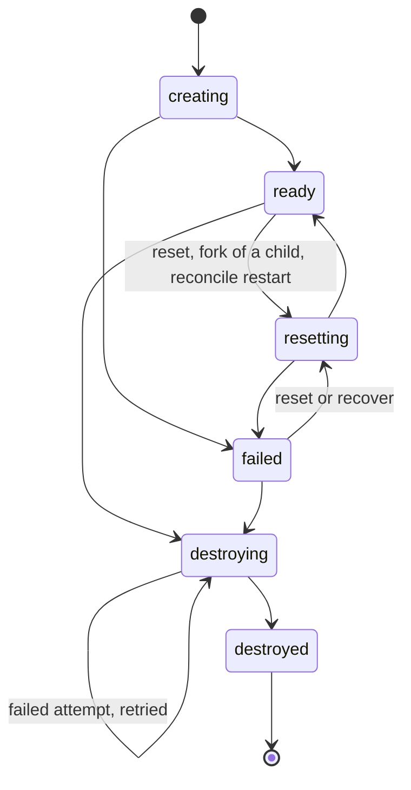

# Troubleshooting

Start with the branch's own story: `pgb history NAME` lists every state
change with its actor and reason, and `pgb doctor` shows what reconcile
would change. branchd's log has the full error behind any short message.

## Branch states and how to get out of them

| State | Meaning | What to do |
|---|---|---|
| `creating`, `resetting` | an operation is running. `resetting` also covers a branch-from-branch freeze or clone of this branch | wait. If the process running it died, reconcile fails the row once it has made no progress for `--stuck-timeout` (default 10m); live operations heartbeat, so a slow one is never failed |
| `failed` | a create, reset, recover or restart did not finish | read `pgb history NAME`. `pgb branch recover NAME` restarts it on its existing data and keeps its writes (for a branch that failed with its volumes intact, such as a parent interrupted mid-freeze or a branch whose container could not be restarted). `pgb branch reset NAME` discards its writes and re-clones it; for a failed create this is a retry. Or destroy it |
| `destroying` | a destroy started and did not finish | run `pgb branch destroy NAME` again; it retries the teardown. Reconcile also retries it after `--stuck-timeout`. Each failed attempt is a `destroying -> destroying` entry in the history |

Reset and recover are refused while another branch is still being created
from this one. The failure reason stored in the registry is capped at 1 KiB
and drops Postgres `DETAIL` and `CONTEXT` lines, which can quote row data;
the error returned to the caller of a failed seed (a `422`) and branchd's log
can still contain row data from the source.

## What reconcile does

branchd runs a reconcile pass at startup and then every
`--reconcile-interval` (default 60s). `pgb doctor` prints the plan without
changing anything (`GET /v1/reconcile/plan`); `pgb gc` applies it
(`POST /v1/reconcile`). Every destructive action is re-checked against the
registry just before it runs, and a pass only touches resources labelled with
its own registry's instance id.

| Action | When |
|---|---|
| `reap` | a ready or failed branch is past its TTL |
| `fail_stuck` | a `creating` or `resetting` branch has made no progress for `--stuck-timeout`. Its half-built resources are removed, but never a volume another branch still depends on |
| `fail_stuck_source` | a `seeding` source has had no heartbeat for `--stuck-timeout`; its half-seeded volume is removed |
| `retry_destroy` | a branch has been `destroying` for longer than `--stuck-timeout` |
| `restart_branch` | a ready branch's container or pod is gone or stopped for good. It is started again on the branch's existing volumes; if it is not ready within 90 s the branch is failed with its volumes kept (use `pgb branch recover`) |
| `update_endpoint` | a ready branch is running at a new address (a new pod IP, a re-published port) |
| `remove_orphan_container` | a managed container or pod has no live registry row |
| `remove_orphan_helper` | a finished helper container or pod, older than `--stuck-timeout`, was never removed |
| `gc_layer` | a frozen layer no live branch references |
| `gc_volume` | a managed volume owned by no live branch or source, older than `--stuck-timeout` |

On Docker, each branch's host port is chosen by pgoverlay (a free loopback
port) and pinned, and branch containers use the `unless-stopped` restart
policy, so Docker, daemon and host restarts keep the port. A `docker stop` or
`docker rm` of a branch container is undone by the next reconcile pass. When a
connection through the router fails to reach a branch, the router re-reads
the branch's address (at most once per branch every 5 s) before refusing.

## Seeding

**The source must be reachable from containers.** The seed runs in a helper
container, so `localhost` means the helper itself.

- Database on the Docker host: `host.docker.internal` works on Docker Desktop
  and Colima. On Linux Docker Engine it does not resolve inside containers;
  use the `docker0` gateway address (usually `172.17.0.1`,
  `ip -4 addr show docker0`), the host's own IP, or put the database and
  pgoverlay on one user-defined network (`--network`). pgoverlay does not add
  a `host-gateway` mapping itself, because on Colima and other Lima-based
  setups that would point the name at the VM instead of your Mac.
- Database in a container: `docker inspect -f '{{range .NetworkSettings.Networks}}{{.IPAddress}}{{end}}' NAME`
  prints its address on every Docker version (Docker 29 removed the old
  `.NetworkSettings.IPAddress` field).
- Seed connections time out after 10 s, and the error names the host and port
  tried. An empty `--host` is rejected.

**`pg_basebackup` needs a replication entry.** The source's `pg_hba.conf`
needs a `host replication <user> <address> <method>` line matching the
helper's address, `wal_level=replica` (or higher), and free
`max_wal_senders`. The stock `postgres` image has no remote replication line.

**Seeding from a standby is supported, and recommended** to keep the load off
the primary. The seed strips `standby.signal`, `recovery.signal` and the
replication and recovery settings (`primary_conninfo`, `restore_command` and
so on) from the copy and logs a warning that the source was a standby;
branches start with those settings blanked.

**The major version must match.** Branches run `postgres:<pg-version>` on the
source's data directory, so for `basebackup` `--pg-version` must be the
source's major; a mismatch fails the seed with the version to use. For
`--via dump` it must be at least the source's major.

**Extensions, locales and libc.** A branch runs the source's data directory,
so its image must carry the source's extensions (and any library in
`shared_preload_libraries`), its locales, and a compatible libc (collations
depend on it). When `postgres:<major>` is not enough, give the source its own
image: `pgb source add geo --image postgis/postgis:17-3.5 ...` or
`--image pgvector/pgvector:pg17`.

**What branches take from the source's configuration.** They ignore the
source's `port`, `listen_addresses`, `unix_socket_directories`, `hba_file` and
`ident_file` (they use the `pg_hba.conf` in the data directory),
`logging_collector`, `archive_mode` and `synchronous_standby_names`, and turn
`ssl` off when the data directory has no `server.crt`. They keep everything
else, including `shared_preload_libraries` and `include` directives. Sources
whose configuration lives outside the data directory (Debian and Ubuntu
packages) get minimal generated `postgresql.conf`, `pg_hba.conf` and
`pg_ident.conf` files.

**Masking and credential rotation connect over the local socket.** They run
`psql` inside the branch as the source's connection user, through the
`local` lines of the source's `pg_hba.conf`. On Docker these commands run as
the `postgres` OS user, so `local` must be `trust`, or `peer` when the
connection user is `postgres`. On Kubernetes they run as root, so `peer` does
not work there; use `trust` for `local`.

**`--via dump` specifics.** The source's roles are recreated as `NOLOGIN`
shells so ownership and grants restore. A scoped dump (`--dump-schema`)
creates the source's extensions first; an extension the image lacks is
reported and skipped (use `--image`). Row-level security policies that call
functions in a schema you did not dump (Supabase's `auth.uid()`, for
example) need that schema in `--dump-schema` too. Schema patterns may not
contain commas.

**TLS to the source.** Seed connections use `PGOVERLAY_SEED_SSLMODE` from
branchd's environment (or `pgb`'s in local mode), default `prefer`. Use
`require` or `verify-full` for a managed provider reached over the internet.

## Connecting

- **`FATAL: pgoverlay: database not available`** from the router means the
  branch after the `@` is unknown, not ready, or unreachable (the router does
  not say which, on purpose). Check the exact name in `pgb branch ls`
  (GitHub App branches look like `gh-d782c8-pr-42`) and its state; branchd's
  log has the real reason.
- **`psql "$(pgb connect NAME)"` asks for a password.** In the default
  inherit mode a branch accepts the source's passwords, and local-mode
  `pgb connect` prints no password: `export PGPASSWORD=<source password>`.
- **The direct URL does not connect.** Branch ports are published on the
  Docker host's `127.0.0.1`, and Kubernetes branches have pod IPs, so the
  direct URL only works on the branchd host or in the cluster. Use the router
  URL.
- **A session through the router is closed after 15 minutes of silence.**
  The router closes a session with no bytes in either direction for 15
  minutes, which includes a single statement that runs longer than that
  without returning anything (a large `CREATE INDEX`). Run such statements on
  the direct connection from the branchd host or in the cluster.
- **Cancel (`Ctrl-C`) does nothing with several branchd replicas.** A cancel
  request has to reach the replica that carries the session. Give the proxy
  Service `sessionAffinity: ClientIP` (the chart does not set it yet).
- **`password_unavailable`**: the branch's rotated password was encrypted
  under an at-rest key branchd no longer has. The branch keeps working for
  everything but connecting with that password; `pgb branch reset NAME`
  mints a new one.

## Disk and layers

**Branches grow when they read.** Postgres opens table files read-write even
for reads, and OverlayFS copies a file whole into the branch on the first
such open. See [Reads copy up too](benchmarks.md#reads-copy-up-too) for the
numbers, and use the zfs or csi backend for read-heavy branches of large
databases. The `pgoverlay_disk_bytes_*` gauges and the alert in
[Observability](observability.md) watch the filesystem.

### Layer chains and `--max-layer-depth`

On the overlay backend, each branch created from a branch freezes the
parent's writable layer, adding one layer to the parent's chain and to the
child's. A reset keeps the chain, and there is no compaction yet, so a
long-lived fixture branch that is forked over and over grows a longer chain
with every fork, and every file lookup walks it. Once a chain reaches
`--max-layer-depth` (default 100), `pgb branch create --from-branch` from that
branch returns `403`. Recreate the fixture from its source
(`pgb branch destroy` then `pgb branch create --from SOURCE`); existing
children keep working, because frozen layers live until no branch uses them.

### `volume already exists`

Creating a branch or source never adopts an existing volume: a stale volume
under a reused name would otherwise become a new branch's data. If a create
fails with `volume already exists`, a volume with that name was left behind
(typically from a registry that was deleted). Make sure nothing uses it,
then remove it with `docker volume rm`, or let `pgb gc` remove it once it is
older than `--stuck-timeout` and owned by no registry row.

## Docker setups

- `ssh://` docker contexts and `DOCKER_HOST=ssh://...` are not supported. Run
  branchd on the Docker host and use `pgb --server`, or forward the socket
  ([Reference](reference.md#environment)).
- With a remote engine, branch ports are published on that host's
  `127.0.0.1`: reach branches through the router.
- On macOS, the overlay mount and all volumes live inside the Docker VM
  (Colima or Docker Desktop), so disk usage counts against the VM's disk.
